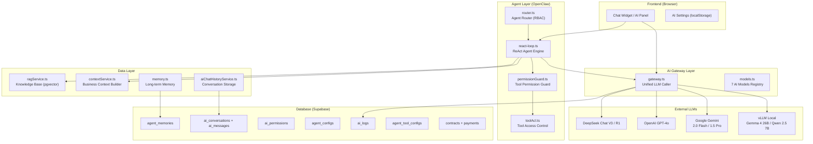
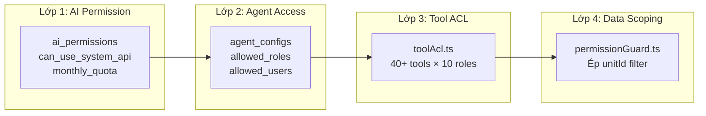

# 🔍 Báo cáo Rà soát Toàn diện Hệ thống AI — CIC ERP

> **Ngày:** 27/05/2026  
> **Phạm vi:** Toàn bộ kiến trúc AI, bảo mật, phân quyền, logic truy vấn dữ liệu  
> **Phương pháp:** Phân tích mã nguồn, cấu hình, logic nghiệp vụ

---

## 📋 Mục lục

1. [Tổng quan Kiến trúc AI](#1-tổng-quan-kiến-trúc-ai)
2. [Các vấn đề BẢO MẬT nghiêm trọng](#2-các-vấn-đề-bảo-mật-nghiêm-trọng)
3. [Phân quyền AI — Đánh giá & Vấn đề](#3-phân-quyền-ai--đánh-giá--vấn-đề)
4. [Truy vấn dữ liệu — Hiệu quả & Logic](#4-truy-vấn-dữ-liệu--hiệu-quả--logic)
5. [Quản trị Agent — Thiết lập & Logic](#5-quản-trị-agent--thiết-lập--logic)
6. [Gợi ý Cải tiến Tổng hợp](#6-gợi-ý-cải-tiến-tổng-hợp)
7. [Roadmap Triển khai](#7-roadmap-triển-khai)

---

## 1. Tổng quan Kiến trúc AI

### 1.1 Sơ đồ Kiến trúc hiện tại



### 1.2 Thành phần chính

| Thành phần | File | Chức năng |
|------------|------|-----------|
| **AI Gateway** | [gateway.ts](file:///d:/CIC%20ERP/services/ai/gateway.ts) | Cổng vào duy nhất cho mọi LLM call (streaming + non-streaming) |
| **Model Registry** | [models.ts](file:///d:/CIC%20ERP/services/ai/models.ts) | 7 model đăng ký (2 local, 3 Gemini, 1 OpenAI, 2 DeepSeek) |
| **ReAct Loop** | [react-loop.ts](file:///d:/CIC%20ERP/services/ai/openclaw/react-loop.ts) | Agent engine — multi-step tool calling |
| **Permission Guard** | [permissionGuard.ts](file:///d:/CIC%20ERP/services/ai/openclaw/permissionGuard.ts) | Middleware bảo mật cho tool execution |
| **Tool ACL** | [toolAcl.ts](file:///d:/CIC%20ERP/services/ai/openclaw/toolAcl.ts) | Ma trận phân quyền tool theo role |
| **Agent Router** | [router.ts](file:///d:/CIC%20ERP/services/ai/openclaw/router.ts) | Điều hướng user → agent phù hợp |
| **Context Service** | [contextService.ts](file:///d:/CIC%20ERP/services/contextService.ts) | Xây dựng business context từ DB |
| **RAG Service** | [ragService.ts](file:///d:/CIC%20ERP/services/ragService.ts) | Knowledge base search (pgvector) |
| **AI Memory** | [memory.ts](file:///d:/CIC%20ERP/services/ai/memory.ts) | Long-term memory cho agents |
| **Chat History** | [aiChatHistoryService.ts](file:///d:/CIC%20ERP/services/aiChatHistoryService.ts) | Lưu trữ hội thoại AI |
| **AI Permissions** | [aiPermissionService.ts](file:///d:/CIC%20ERP/services/aiPermissionService.ts) | Quản lý quota + quyền sử dụng AI |
| **Agent Config** | [agentConfigService.ts](file:///d:/CIC%20ERP/services/ai/agentConfigService.ts) | CRUD cấu hình agent từ DB |

---

## 2. Các vấn đề BẢO MẬT nghiêm trọng

### 🔴 Mức độ CRITICAL (Cần xử lý NGAY)

#### C1. API Keys lộ trong `.env.local` — **Commit vào Git**

> [!CAUTION]
> File [.env.local](file:///d:/CIC%20ERP/.env.local) chứa **TẤT CẢ API keys thật** (DeepSeek, Google, OpenAI, Supabase, Resend, Vercel OIDC token) và có thể đã bị commit vào Git history. Đây là rủi ro bảo mật CỰC KỲ NGHIÊM TRỌNG.

**Bằng chứng:**
```
VITE_DEEPSEEK_API_KEY="sk-5e4c6eb4..."
VITE_GOOGLE_API_KEY="AIzaSyCA..."
VITE_OPENAI_API_KEY="sk-proj-Dfc..."
VITE_SUPABASE_ANON_KEY="eyJhbGci..."
RESEND_API_KEY=re_UjTZH...
VERCEL_OIDC_TOKEN="eyJhbGci..."
```

**Rủi ro:** Bất kỳ ai có quyền truy cập repo đều có thể lấy API keys → gây tốn phí, lộ dữ liệu.

**Khuyến nghị:**
- ✅ **Rotate ngay** tất cả API keys hiện tại
- ✅ Chuyển sang Vercel Environment Variables (server-side only)
- ✅ Sử dụng `VITE_` prefix chỉ cho các biến an toàn (Supabase URL, Anon Key)
- ✅ Kiểm tra Git history, dùng `git filter-branch` hoặc `BFG Repo Cleaner` để xóa keys khỏi lịch sử

---

#### C2. API Keys lưu trong `localStorage` — Client-side exposure

> [!CAUTION]
> Hệ thống cho phép user lưu API keys cá nhân trong `localStorage` (browser).

**Bằng chứng** (trong [gateway.ts](file:///d:/CIC%20ERP/services/ai/gateway.ts#L63-L73)):
```typescript
function getCustomKey(provider: AIProvider): string | null {
  const keyMap: Record<string, string> = {
    gemini: 'cic_custom_gemini_key',
    openai: 'cic_custom_openai_key',
    deepseek: 'cic_custom_deepseek_key',
  };
  return localStorage.getItem(storageKey) || null;
}
```

**Rủi ro:** XSS attack → đọc được API keys. `localStorage` không được mã hóa.

**Khuyến nghị:**
- ✅ Chuyển sang server-side proxy (Edge Function) để giấu API keys
- ✅ Nếu phải lưu client-side, dùng `sessionStorage` + encrypt
- ✅ Tách riêng API keys của tổ chức vs cá nhân

---

#### C3. `dangerouslyAllowBrowser: true` — Gọi AI API trực tiếp từ browser

> [!WARNING]
> OpenAI SDK được khởi tạo với `dangerouslyAllowBrowser: true`, nghĩa là API key được expose trực tiếp trong browser network tab.

**Bằng chứng** (trong [gateway.ts](file:///d:/CIC%20ERP/services/ai/gateway.ts#L415-L429)):
```typescript
client = new OpenAI({
  apiKey,
  dangerouslyAllowBrowser: true,  // ← API key visible in DevTools
});
```

**Khuyến nghị:**
- ✅ Tạo Supabase Edge Function hoặc Vercel API Route làm proxy
- ✅ Browser chỉ gọi proxy, proxy gọi LLM provider với server-side key

---

#### C4. Hardcoded API key cho vLLM Local

> [!WARNING]
> API key mặc định `sk-cic-2026` được hardcode trong source code.

**Bằng chứng** (trong [gateway.ts](file:///d:/CIC%20ERP/services/ai/gateway.ts#L30)):
```typescript
localApiKey: (import.meta.env?.VITE_LITELLM_KEY) || 'sk-cic-2026',
```

**Khuyến nghị:**
- ✅ Bỏ fallback hardcoded, bắt buộc đặt env var
- ✅ Rotate key `sk-cic-2026` ngay

---

#### C5. RLS chưa được bật trên các bảng chính

> [!CAUTION]
> Theo tài liệu [PHANQUYENHETHONG.md](file:///d:/CIC%20ERP/PHANQUYENHETHONG.md#L283): "Row Level Security (RLS) hiện chưa được bật trên các bảng chính". Việc kiểm soát phân quyền **hoàn toàn ở tầng ứng dụng**.

**Rủi ro:** Nếu attacker có Supabase anon key (đã lộ trong `.env.local`), họ có thể query trực tiếp bất kỳ bảng nào mà không cần qua ứng dụng.

**Khuyến nghị:**
- ✅ Bật RLS trên tất cả bảng chứa dữ liệu nhạy cảm
- ✅ Ưu tiên: `contracts`, `payments`, `employees`, `ai_logs`, `ai_conversations`, `ai_messages`
- ✅ Tạo RLS policies dựa trên `auth.uid()` + `profiles.role` + `profiles.unit_id`

---

### 🟠 Mức độ HIGH (Cần xử lý trong 1-2 tuần)

#### H1. Gemini API Key lộ trong URL query string

**Bằng chứng** (trong [ragService.ts](file:///d:/CIC%20ERP/services/ragService.ts#L81-L82)):
```typescript
const response = await fetch(
  `https://generativelanguage.googleapis.com/v1beta/models/text-embedding-004:embedContent?key=${apiKey}`,
```

**Rủi ro:** API key xuất hiện trong URL → lưu trong browser history, server logs, proxy logs.

**Khuyến nghị:**
- ✅ Chuyển API key vào header `x-goog-api-key` thay vì query parameter
- ✅ Hoặc proxy qua server-side

---

#### H2. Chat Summary sử dụng DeepSeek trực tiếp từ browser

**Bằng chứng** (trong [chatService.ts](file:///d:/CIC%20ERP/services/chatService.ts#L618-L626)):
```typescript
const apiKey = localStorage.getItem('cic_custom_deepseek_key') || import.meta.env.VITE_DEEPSEEK_API_KEY;
const client = new OpenAI({
  baseURL: 'https://api.deepseek.com',
  apiKey,
  dangerouslyAllowBrowser: true,
});
```

**Rủi ro:** API key DeepSeek lộ qua browser DevTools.

---

#### H3. AI Logs không có RLS — User có thể đọc log của người khác

Bảng `ai_logs` lưu toàn bộ input/output preview (500 chars), nhưng không có RLS. User A có thể đọc prompt/response của User B nếu biết cách query Supabase trực tiếp.

---

#### H4. AI Conversations/Messages thiếu owner validation

Trong [aiChatHistoryService.ts](file:///d:/CIC%20ERP/services/aiChatHistoryService.ts#L72-L76):
```typescript
export async function deleteConversation(convId: string): Promise<void> {
  await dataClient.from('ai_messages').delete().eq('conversation_id', convId);
  await dataClient.from('ai_conversations').delete().eq('id', convId);
}
```

**Vấn đề:** Không kiểm tra xem user hiện tại có phải owner của conversation không. Bất kỳ user nào biết `convId` đều có thể xóa.

---

## 3. Phân quyền AI — Đánh giá & Vấn đề

### 3.1 Kiến trúc Phân quyền hiện tại (Tốt ✅)

Hệ thống phân quyền AI có **4 lớp bảo vệ**, đây là điểm mạnh:



### 3.2 Điểm mạnh ✅

| Khía cạnh | Đánh giá |
|-----------|----------|
| **Tool ACL ma trận** | 40+ tools được phân quyền chi tiết theo 10 roles. Đây là thiết kế tốt. |
| **Permission Guard** | Middleware tự động ép `unitId` cho non-global roles, chặn leo thang phạm vi. |
| **Audit Logger** | Ghi log mỗi tool call (userId, toolName, args, result). |
| **Data Scope** | Phân biệt `company` vs `unit` vs `personal` scope cho từng tool. |
| **Sensitivity levels** | 4 mức độ nhạy cảm: public, internal, confidential, restricted. |
| **Agent routing** | Agent tự động match theo role + đơn vị. |

### 3.3 Vấn đề & Thiếu sót ⚠️

#### P1. Không có cơ chế "revoke" API key cho user cụ thể

Bảng `ai_permissions` có `can_use_system_api` nhưng **không có cơ chế lock/ban** khi phát hiện user lạm dụng. Chỉ có ON/OFF đơn giản.

**Khuyến nghị:**
- ✅ Thêm trường `is_locked` + `locked_reason` + `locked_at`
- ✅ Tự động lock khi usage vượt 150% quota
- ✅ Alert cho Admin khi có anomaly

---

#### P2. Quota reset không tự động

Trong [aiPermissionService.ts](file:///d:/CIC%20ERP/services/aiPermissionService.ts#L9-L11):
```typescript
monthly_quota: number;     // 0 = unlimited
usage_count: number;
quota_reset_at: string;
```

**Vấn đề:** Không thấy cron job hay trigger nào tự động reset `usage_count` hàng tháng. Nếu quên reset thủ công, user sẽ bị chặn vĩnh viễn.

**Khuyến nghị:**
- ✅ Tạo Supabase Cron (pg_cron) reset usage_count vào ngày 1 hàng tháng
- ✅ Hoặc kiểm tra `quota_reset_at` mỗi lần dùng, tự reset nếu đã qua tháng mới

---

#### P3. GLOBAL_ROLES không nhất quán giữa các file

| File | GLOBAL_ROLES |
|------|-------------|
| [permissionGuard.ts](file:///d:/CIC%20ERP/services/ai/openclaw/permissionGuard.ts#L10) | `Admin, Leadership, Legal, Accountant, ChiefAccountant, Marketing` |
| [toolAcl.ts](file:///d:/CIC%20ERP/services/ai/openclaw/toolAcl.ts#L35) | `Admin, Leadership, Legal, Accountant, ChiefAccountant, Marketing` |
| [contextService.ts](file:///d:/CIC%20ERP/services/contextService.ts#L3) | Import từ `lib/permissions.ts` (có thể khác) |

**Vấn đề:** Nếu `lib/permissions.ts` có danh sách khác → xung đột phân quyền. Ví dụ: `BackOffice` được nhắc trong [PHANQUYENHETHONG.md](file:///d:/CIC%20ERP/PHANQUYENHETHONG.md#L209) nhưng thiếu trong Tool ACL.

**Khuyến nghị:**
- ✅ Tập trung `GLOBAL_ROLES` vào 1 file duy nhất, import ở mọi nơi
- ✅ Thêm `BackOffice` vào Tool ACL nếu cần

---

#### P4. Tool ACL thiếu role `BackOffice`

Theo tài liệu [PHANQUYENHETHONG.md](file:///d:/CIC%20ERP/PHANQUYENHETHONG.md#L207-L211), `BackOffice` có quyền truy vấn **toàn công ty**. Tuy nhiên, trong [toolAcl.ts](file:///d:/CIC%20ERP/services/ai/openclaw/toolAcl.ts) không có role `BackOffice` nào được khai báo.

**Hệ quả:** Nhân viên phòng Tổng hợp (BackOffice) sẽ bị giới hạn chỉ xem dữ liệu đơn vị mình khi dùng AI tools, **trái với quy định phân quyền**.

---

#### P5. Role `Dev` xuất hiện trong router nhưng không có trong hệ thống

Trong [router.ts](file:///d:/CIC%20ERP/services/ai/openclaw/router.ts#L29):
```typescript
if (['Admin', 'Leadership', 'Dev'].includes(context.role)) {
  return true;
}
```

**Vấn đề:** Role `Dev` không tồn tại trong enum `user_role` (PHANQUYENHETHONG.md chỉ có 9 roles). Đây có thể là backdoor development hoặc code thừa.

**Khuyến nghị:**
- ✅ Loại bỏ `Dev` khỏi production code
- ✅ Nếu cần developer access, sử dụng role `Admin` hoặc feature flag

---

#### P6. Agent `allowed_users` dùng `employeeId` thay vì `userId`

Trong [router.ts](file:///d:/CIC%20ERP/services/ai/openclaw/router.ts#L15):
```typescript
if (hasUsers && context.employeeId && agent.allowedUsers?.includes(context.employeeId)) {
```

**Vấn đề:** `allowedUsers` matching bằng `employeeId` nhưng trường này có thể null/undefined nếu user chưa liên kết nhân sự. Nên cân nhắc matching bằng `userId` (auth ID) cho nhất quán.

---

## 4. Truy vấn dữ liệu — Hiệu quả & Logic

### 4.1 Context Service — Phân tích

[contextService.ts](file:///d:/CIC%20ERP/services/contextService.ts) xây dựng "Báo cáo Quản trị Thông minh" cho AI bằng cách:
1. Fetch **TẤT CẢ** contracts + payments
2. Tính toán doanh thu theo năm/quý/tháng trên client-side
3. Cache 5 phút trong memory

#### Vấn đề hiệu suất:

> [!WARNING]
> **Q1. Full table scan** — Hệ thống load TOÀN BỘ contracts + payments vào browser memory mỗi 5 phút.

**Bằng chứng** (trong [contextService.ts](file:///d:/CIC%20ERP/services/contextService.ts#L82-L84)):
```typescript
const contractRes = await supabase.from('contracts').select(
  'id, unit_id, employee_id, value, actual_revenue, status, vat_rate, has_vat, signed_date, start_date, end_date, payments(...)'
);
```

**Hệ quả:** Khi số lượng hợp đồng tăng lên hàng nghìn, việc load ALL + lồng payments → rất chậm, tốn RAM.

**Khuyến nghị:**
- ✅ Tạo database view hoặc materialized view tính sẵn aggregation
- ✅ Sử dụng Supabase RPC (stored procedure) để tính thống kê trên server
- ✅ Tách context theo thời gian: chỉ load năm hiện tại + năm trước cho báo cáo nhanh

---

> [!WARNING]
> **Q2. Doanh thu tính client-side, logic phức tạp** — Hàm `calculateRevenue()` có 3 nhánh tính toán.

```typescript
const calculateRevenue = (contract: any): number => {
  if (contract.actual_revenue && contract.actual_revenue > 0) {
    return Number(contract.actual_revenue);
  }
  // Fallback: tính từ payments VAT_INVOICE...
};
```

**Rủi ro:** Logic tính toán bị duplicate (Dashboard cũng tính, Context cũng tính). Nếu sửa 1 nơi mà quên nơi kia → số liệu AI trả lời sai.

**Khuyến nghị:**
- ✅ Tập trung logic tính doanh thu vào **1 DB function** hoặc **1 shared utility**
- ✅ Context service chỉ lấy kết quả đã tính sẵn

---

> [!IMPORTANT]
> **Q3. Context text quá dài** — Báo cáo context có thể lên đến 10-20KB text.

Mỗi lần chat, AI phải đọc toàn bộ context dài (tổng quan + theo năm + theo quý + theo tháng + top đơn vị + top nhân sự). Điều này:
- Tốn tokens (tốn tiền API)
- Giảm context window cho conversation thực tế
- AI dễ "quên" thông tin khi context quá dài

**Khuyến nghị:**
- ✅ Tách context thành các **tools riêng** (get_yearly_stats, get_quarterly_stats)
- ✅ AI chỉ gọi tool cần thiết thay vì nhận toàn bộ context
- ✅ Giảm context base xuống ~2KB (chỉ tổng quan + năm hiện tại)

---

### 4.2 RAG Service — Phân tích

[ragService.ts](file:///d:/CIC%20ERP/services/ragService.ts) hỗ trợ 2 bảng knowledge:
- `document_chunks` (mới, ưu tiên)
- `app_documents` (cũ, fallback)

#### Vấn đề:

| # | Vấn đề | Chi tiết |
|---|--------|----------|
| **R1** | **Embedding provider inconsistency** | `ragService.ts` có `generateEmbedding()` riêng, `gateway.ts` cũng có `generateEmbedding()` riêng. Hai hàm khác nhau nhưng cùng tên. |
| **R2** | **Fallback không log** | Khi local embedding fail, tự động fallback sang Gemini nhưng không log sự kiện này. Khó debug. |
| **R3** | **Threshold cố định 0.5** | Ngưỡng similarity mặc định 0.5 có thể quá cao hoặc quá thấp tùy loại query. Nên cho phép adjust. |
| **R4** | **Limit 3 chunks mặc định** | Chỉ trả 3 chunks mặc định — có thể thiếu context cho câu hỏi phức tạp. |
| **R5** | **Không có re-ranking** | Kết quả similarity search không được re-rank bằng cross-encoder, dẫn đến chất lượng RAG thấp. |

**Khuyến nghị:**
- ✅ Hợp nhất embedding function vào 1 nơi duy nhất
- ✅ Thêm log khi fallback
- ✅ Cho phép admin điều chỉnh threshold/limit
- ✅ Thêm re-ranking (Cohere Rerank hoặc cross-encoder local)

---

### 4.3 Tool Calling — Phân tích

#### Gemma Tool Call Parsing

Trong [gateway.ts](file:///d:/CIC%20ERP/services/ai/gateway.ts#L620-L714), có logic `extractGemmaToolCalls()` rất phức tạp để parse tool calls từ Gemma format:

```typescript
function extractGemmaToolCalls(content: string): { tool_calls: any[], cleaned_content: string } | null {
  // Dọn dẹp sơ bộ lỗi sinh ký tự của vLLM Gemma
  content = content.replace(/<<\|tool_call\|>/g, '<|tool_call|>');
  // ... 90 dòng regex parsing ...
}
```

**Vấn đề:**
- Parser rất phức tạp, dễ break khi Gemma thay đổi format
- Regex-based parsing không robust bằng structured output
- Không có unit test cho parser

**Khuyến nghị:**
- ✅ Sử dụng structured output (JSON mode) nếu vLLM hỗ trợ
- ✅ Viết unit test cho `extractGemmaToolCalls()` với nhiều edge cases
- ✅ Cân nhắc chuyển sang Qwen (hỗ trợ tool calling native qua OpenAI format)

---

### 4.4 Streaming Tool Call Filter

Trong [gateway.ts](file:///d:/CIC%20ERP/services/ai/gateway.ts#L475-L523), streaming response lọc bỏ `<|tool_call|>` tags. Logic balanced brace matching phức tạp:

**Vấn đề:**
- Buffer limit cứng 500 chars — tool calls dài hơn sẽ bị cắt
- Partial tag matching logic khó maintain

---

## 5. Quản trị Agent — Thiết lập & Logic

### 5.1 Agent Configuration

Hệ thống có thiết kế agent theo department tốt, lưu trong bảng `agent_configs`:

| Field | Ý nghĩa |
|-------|---------|
| `system_prompt` | Persona + chuyên môn |
| `allowed_tools` | Danh sách tool được phép |
| `allowed_roles` | Roles được phép truy cập |
| `allowed_users` | Users cụ thể được phép |
| `data_scope` | `company` hoặc `unit` |
| `preferred_model` | Model ưu tiên |
| `can_write` / `can_approve` | Quyền ghi/phê duyệt |

### 5.2 Vấn đề Logic Agent

#### A1. `syncFromDefinitions` có thể ghi đè admin customization

Trong [agentConfigService.ts](file:///d:/CIC%20ERP/services/ai/agentConfigService.ts#L131-L176):

Khi sync, hệ thống **preserve** `system_prompt`, `is_active`, `allowed_roles`, `allowed_users` nhưng **ghi đè** `allowed_tools`, `preferred_model`, `icon`, `color`.

**Vấn đề:** Nếu Admin đã customize `allowed_tools` trên DB, sync sẽ reset lại.

**Khuyến nghị:**
- ✅ Thêm flag `is_customized` cho mỗi field
- ✅ Chỉ sync fields chưa bị customize

---

#### A2. Fallback agent không rõ ràng

Trong [router.ts](file:///d:/CIC%20ERP/services/ai/openclaw/router.ts#L53):
```typescript
return agentDefinitions['SYSTEM'] || Object.values(agentDefinitions)[0];
```

**Vấn đề:** Nếu `SYSTEM` agent không tồn tại, lấy agent đầu tiên → kết quả không deterministic.

---

#### A3. System Prompt quá dài và lặp lại

`OPENCLAW_SYSTEM_PROMPT_PREFIX` trong [react-loop.ts](file:///d:/CIC%20ERP/services/ai/openclaw/react-loop.ts#L8-L20) dài ~8 dòng nguyên tắc bắt buộc. Kết hợp với agent-specific prompt → system prompt tổng có thể lên 2-3KB.

**Khuyến nghị:**
- ✅ Rút gọn system prompt
- ✅ Tách thành "core rules" (ngắn) + "context" (chỉ khi cần)

---

#### A4. `X-Impersonate-User` header — Potential privilege escalation

Trong [gateway.ts](file:///d:/CIC%20ERP/services/ai/gateway.ts#L416):
```typescript
defaultHeaders: request.meta?.userId ? { 'X-Impersonate-User': request.meta.userId } : undefined,
```

**Rủi ro:** Nếu vLLM server xử lý header này, attacker có thể giả mạo user khác.

**Khuyến nghị:**
- ✅ Xác minh vLLM không sử dụng header này cho bất kỳ logic nào
- ✅ Nếu chỉ dùng cho logging, đổi tên thành `X-Request-User-Id`

---

### 5.3 Model Management

#### M1. Token estimation không chính xác

Trong [gateway.ts](file:///d:/CIC%20ERP/services/ai/gateway.ts#L221-L223):
```typescript
const estimatedPromptTokens = Math.ceil(inputText.length / 4);
const estimatedCompletionTokens = Math.ceil(outputBuffer.length / 4);
```

**Vấn đề:** "~4 chars per token" là ước lượng rất thô cho tiếng Việt (thường ~2-3 chars/token). Cost tracking sẽ sai lệch 30-50%.

**Khuyến nghị:**
- ✅ Sử dụng tokenizer chính xác (tiktoken cho OpenAI, Gemini SDK có token count)
- ✅ Hoặc dùng `usage` response từ API nếu có

---

#### M2. max_tokens cứng cho local models

```typescript
max_tokens: provider === 'local' ? Math.min(request.maxTokens || 2048, 3000) : request.maxTokens,
```

**Vấn đề:** Cap 3000 tokens cho local model có thể quá ít cho báo cáo dài. Gemma 4 26B hỗ trợ 32K context window.

---

## 6. Gợi ý Cải tiến Tổng hợp

### 6.1 Bảo mật (Ưu tiên CRITICAL)

| # | Cải tiến | Mức độ | Nỗ lực |
|---|----------|--------|--------|
| 1 | **Rotate tất cả API keys** đã lộ trong `.env.local` | 🔴 Critical | 1 giờ |
| 2 | **Chuyển API calls sang server-side proxy** (Edge Function) | 🔴 Critical | 2-3 ngày |
| 3 | **Bật RLS** trên bảng `ai_logs`, `ai_conversations`, `ai_messages`, `agent_memories` | 🔴 Critical | 1 ngày |
| 4 | **Xóa `.env.local` khỏi Git history** bằng BFG | 🔴 Critical | 2 giờ |
| 5 | **Bỏ `dangerouslyAllowBrowser: true`** — proxy qua server | 🟠 High | 2 ngày |
| 6 | **Thêm owner validation** cho delete conversation | 🟠 High | 30 phút |
| 7 | **Chuyển Gemini API key từ URL sang header** | 🟠 High | 30 phút |
| 8 | **Bỏ role `Dev`** khỏi production code | 🟡 Medium | 15 phút |
| 9 | **Bỏ hardcoded `sk-cic-2026`** | 🟡 Medium | 15 phút |

### 6.2 Phân quyền (Ưu tiên HIGH)

| # | Cải tiến | Mức độ | Nỗ lực |
|---|----------|--------|--------|
| 10 | **Thêm role `BackOffice`** vào Tool ACL | 🟠 High | 1 giờ |
| 11 | **Hợp nhất `GLOBAL_ROLES`** vào 1 file duy nhất | 🟠 High | 1 giờ |
| 12 | **Auto-reset quota** hàng tháng (pg_cron) | 🟠 High | 1 giờ |
| 13 | **Thêm cơ chế lock/ban** cho AI abuse | 🟡 Medium | 2 giờ |
| 14 | **Đổi `allowedUsers` sang userId** thay vì employeeId | 🟡 Medium | 1 giờ |
| 15 | **Thêm `cross_unit_visibility` vào AI tool scoping** | 🟡 Medium | 3 giờ |

### 6.3 Hiệu suất Truy vấn (Ưu tiên HIGH)

| # | Cải tiến | Mức độ | Nỗ lực |
|---|----------|--------|--------|
| 16 | **Tạo materialized view cho thống kê** thay vì full scan | 🟠 High | 1 ngày |
| 17 | **Tách context dài thành tools riêng** | 🟠 High | 3 giờ |
| 18 | **Hợp nhất hàm calculateRevenue** vào 1 nơi | 🟠 High | 2 giờ |
| 19 | **Hợp nhất 2 hàm generateEmbedding** | 🟡 Medium | 1 giờ |
| 20 | **Thêm re-ranking cho RAG** | 🟡 Medium | 1 ngày |
| 21 | **Tăng max_tokens local model** lên 8000 | 🟢 Low | 15 phút |

### 6.4 Logic & Quản trị (Ưu tiên MEDIUM)

| # | Cải tiến | Mức độ | Nỗ lực |
|---|----------|--------|--------|
| 22 | **Viết unit test cho `extractGemmaToolCalls()`** | 🟡 Medium | 2 giờ |
| 23 | **Sử dụng token count chính xác** thay vì ước lượng | 🟡 Medium | 2 giờ |
| 24 | **Thêm flag `is_customized`** cho agent config sync | 🟡 Medium | 1 giờ |
| 25 | **Rút gọn system prompt** | 🟡 Medium | 1 giờ |
| 26 | **Thêm monitoring dashboard cho AI usage** | 🟡 Medium | 1 ngày |
| 27 | **Thêm health check endpoint cho vLLM** | 🟢 Low | 2 giờ |
| 28 | **Structured output** cho tool calling thay vì regex parsing | 🟢 Low | 1 ngày |

### 6.5 Nâng cao (Ưu tiên LOW — Chiến lược dài hạn)

| # | Cải tiến | Mô tả |
|---|----------|-------|
| 29 | **Semantic caching** | Cache kết quả AI cho câu hỏi tương tự (similarity > 0.95) |
| 30 | **Tool result caching** | Cache kết quả tool calls (thống kê không đổi trong 5p) |
| 31 | **Multi-turn memory summarization** | Tóm tắt lịch sử dài để tiết kiệm tokens |
| 32 | **A/B testing models** | So sánh chất lượng Gemma vs Gemini vs DeepSeek |
| 33 | **User feedback loop** | Thu thập 👍👎 từ user → finetune/improve prompts |
| 34 | **Prompt versioning** | Lưu version history của system prompts |
| 35 | **Rate limiting per-endpoint** | Giới hạn request/phút cho từng model provider |

---

## 7. Roadmap Triển khai

### Phase 1: Khẩn cấp (Tuần 1)
```
[x] Rotate tất cả API keys
[x] Xóa .env.local khỏi Git history
[ ] Bật RLS trên bảng AI-related
[ ] Thêm owner validation cho AI conversations
[ ] Bỏ role Dev, bỏ hardcoded key
```

### Phase 2: Củng cố (Tuần 2-3)
```
[ ] Chuyển API calls sang server-side proxy
[ ] Hợp nhất GLOBAL_ROLES
[ ] Thêm BackOffice vào Tool ACL
[ ] Tạo materialized view thống kê
[ ] Hợp nhất calculateRevenue + generateEmbedding
[ ] Auto-reset quota (pg_cron)
```

### Phase 3: Nâng cao (Tháng 2-3)
```
[ ] Tách context thành tools riêng
[ ] Thêm re-ranking cho RAG
[ ] Monitoring dashboard AI usage
[ ] Token count chính xác
[ ] Structured output cho tool calling
[ ] Semantic caching
```

---

## 📊 Tóm tắt Đánh giá

| Khía cạnh | Điểm | Ghi chú |
|-----------|:----:|---------|
| **Kiến trúc tổng thể** | 8/10 | Thiết kế tốt: Gateway → Agent → Tools pipeline. Có fallback, retry, logging. |
| **Bảo mật** | 4/10 | API keys lộ, thiếu RLS, client-side exposure. Cần xử lý khẩn cấp. |
| **Phân quyền** | 7/10 | Tool ACL chi tiết, Permission Guard tốt. Thiếu BackOffice, inconsistency GLOBAL_ROLES. |
| **Hiệu suất truy vấn** | 5/10 | Full table scan, context quá dài, logic tính toán duplicate. |
| **Logic quản trị** | 7/10 | Agent config DB-driven, tool config customizable. Cần unit test, structured output. |
| **Observability** | 6/10 | Có ai_logs, cost tracking. Token estimation thô, thiếu monitoring dashboard. |

> [!IMPORTANT]
> **Ưu tiên số 1:** Xử lý ngay các vấn đề bảo mật CRITICAL (C1-C5) trước khi thực hiện bất kỳ cải tiến nào khác. Đặc biệt việc API keys đã lộ trong source code là rủi ro lớn nhất hiện tại.
