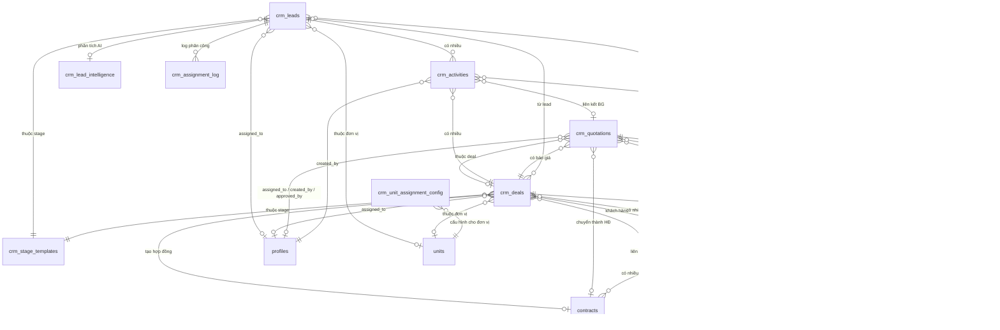

# CRM Module — Thiết kế Tổng thể
> **Phiên bản:** 2.1 — 04/06/2026  
> **Mô hình tham chiếu:** Bitrix24 CRM  
> **Tích hợp:** CIC ERP (Contract · HRM · Projects · Finance)

---

## 1. Tổng quan kiến trúc

### 1.1 Triết lý thiết kế

CRM của CIC không phải là một hệ thống độc lập — nó là **cửa ngõ đầu vào** của toàn bộ vòng đời kinh doanh. Mọi hợp đồng đều bắt đầu từ một Lead. Mọi thanh toán đều có nguồn gốc từ một Deal.

```
[Thị trường]
     │
     ▼
  LEAD ──── thu thập đầu mối, phân loại
     │
     │ Convert (CompleteLeadModal)
     ▼
 ┌──────────────────────────────┐
 │  COMPANY  ◄──── CONTACT      │  ← Entities tái sử dụng được
 └──────────┬───────────────────┘
            │ gắn vào
            ▼
   DEAL ──── pipeline bán hàng, theo dõi cơ hội
     │
     │ Tạo báo giá
     ▼
 QUOTATION ── line items, thuế, điều khoản, phê duyệt
     │
     │ Convert → Contract (module hợp đồng hiện tại)
     ▼
 CONTRACT ── vòng đời hợp đồng CIC ERP
```

### 1.2 Phân tầng entities

| Entity | Bảng DB | Trạng thái | Mô tả |
|--------|---------|-----------|-------|
| **Lead** | `crm_leads` | ✅ Đầy đủ | Đầu mối chưa xác thực |
| **Company** | `customers` (tái dùng) | ⚠️ Cần UI CRM riêng | Khách hàng/Đối tác |
| **Contact** | `customer_contacts` (tái dùng) | ⚠️ Cần UI CRM riêng | Người liên hệ tại Company |
| **Deal** | `crm_deals` | 🔶 Cần hoàn thiện | Cơ hội kinh doanh |
| **Quotation** | `crm_quotations` *(chưa có)* | ❌ Cần tạo mới | Báo giá chính thức |
| **Activity** | `crm_activities` | ✅ Có | Nhật ký tương tác |

---

## 2. Entities chi tiết

### 2.1 Lead — Đầu mối

**Mục đích:** Ghi nhận mọi tín hiệu thị trường trước khi xác thực. Lead là "thô" — chưa biết thực sự là ai, muốn gì.

**Pipeline stages (đề xuất cập nhật — chi tiết hơn seed hiện tại):**

```
┌──────────┐  ┌──────────┐  ┌──────────┐  ┌──────────┐  ┌──────────┐
│   MỚI    │→ │ ĐANG XỬ  │→ │ ĐÃ LIÊN  │→ │ ĐỦ ĐIỀU  │→ │ CHUYỂN   │
│  (New)   │  │   LÝ     │  │   HỆ     │  │  KIỆN    │  │   ĐỔI    │
│  #93C5FD │  │(In Prog.)│  │(Contacted│  │(Qualified│  │(Converted│
└──────────┘  └──────────┘  └──────────┘  └──────────┘  └──────────┘
                                                               ↓
                                           ┌──────────┐  ┌──────────┐
                                           │ KHÔNG    │  │   MẤT    │
                                           │ ĐỦ ĐK   │  │  (Lost)  │
                                           │(Unqualif)│  └──────────┘
                                           └──────────┘
```

| Stage | Color | is_win | is_lose | Mô tả |
|-------|-------|--------|---------|-------|
| Mới | `#93C5FD` | false | false | Lead vừa tạo, chưa ai xử lý |
| Đang xử lý | `#60A5FA` | false | false | Sale đang nghiên cứu, chưa liên hệ |
| Đã liên hệ | `#3B82F6` | false | false | Đã gọi/nhắn, chờ phản hồi |
| Đủ điều kiện | `#1D4ED8` | false | false | Xác nhận có nhu cầu và ngân sách |
| Chuyển đổi | `#8B5CF6` | false | false | Hoàn thành — tạo Deal/Contact/Company |
| Không đủ ĐK | `#F87171` | false | true | Không phù hợp — đóng lead |
| Mất | `#6B7280` | false | true | Có nhu cầu nhưng chọn đối thủ |

> Kết quả cuối (won/lost) xác định bởi `completion_result` khi vào stage "Chuyển đổi" — không phải bởi `is_win/is_lose` của stage.

**Migration cần chạy:** Cập nhật seed data `crm_stage_templates` cho entity_type = 'lead'.

**Luồng hoàn thành (Bitrix24-style, đã có):**

Khi Lead đến stage "Hoàn thành", sale chọn 1 trong 8 kết quả:
- `deal+contact+company` — tạo cả 3 entities
- `deal+contact` — tạo Deal + Liên hệ
- `deal+company` — tạo Deal + Công ty  
- `deal` — chỉ tạo Deal
- `contact+company` — tạo Liên hệ + Công ty (không có deal ngay)
- `contact` — chỉ tạo Liên hệ
- `company` — chỉ tạo Công ty
- `not_opportunity` — không phải cơ hội (kèm ghi chú bắt buộc)

**Fields đầy đủ:**

| Field | Type | Ghi chú |
|-------|------|---------|
| `title` | TEXT | Tên đầu mối (bắt buộc) |
| `name` | TEXT | Tên người liên hệ |
| `company_name` | TEXT | Tên công ty (text tự do) |
| `phone` / `email` | TEXT | Liên lạc |
| `source` | ENUM | Xem bảng Lead Sources bên dưới |
| `source_detail` | TEXT | Ghi chú chi tiết nguồn (URL, email, hotline, tên người giới thiệu...) |
| `stage_id` | UUID → crm_stage_templates | Pipeline stage |
| `expected_value` | DECIMAL | Giá trị ước tính |
| `products` | JSONB | Sản phẩm/dịch vụ quan tâm |
| `customer_id` | → customers | Nếu đã xác định được KH |
| `assigned_to` | → profiles | Nhân viên phụ trách |
| `unit_id` | → units | Đơn vị kinh doanh |
| `completion_result` | TEXT | Kết quả xử lý |
| `is_opportunity` | BOOL | true/false/null |
| `completed_at` | TIMESTAMPTZ | Thời điểm hoàn thành |

**Lead Sources — Nguồn đầu mối:**

| Giá trị | Nhãn hiển thị | Icon | Gợi ý `source_detail` |
|---------|---------------|------|----------------------|
| `website` | Website / Landing Page | 🌐 | URL trang cụ thể — vd: `/dich-vu-tu-van-xay-dung` |
| `email` | Email | 📧 | Địa chỉ email nhận được — vd: `info@cic.vn` |
| `phone` | Điện thoại | 📞 | Số hotline được gọi đến — vd: `1800-1234` |
| `referral` | Giới thiệu / Referral | 🤝 | Tên người/tổ chức giới thiệu — vd: `Anh Minh - Công ty XYZ` |
| `social` | Mạng xã hội | 📱 | Kênh cụ thể — vd: `Zalo OA CIC Hà Nội` / `LinkedIn` |
| `event` | Sự kiện / Hội thảo | 📋 | Tên sự kiện, ngày, địa điểm — vd: `Triển lãm Vietbuild HCM 06/2026` |
| `import` | Import thủ công | 📥 | Tên file, chiến dịch — vd: `Danh sách hội thảo BIM T5/2026.xlsx` |
| `api` | API bên thứ 3 | 🔗 | Tên hệ thống tích hợp — vd: `HubSpot sync` |
| `other` | Khác | — | Mô tả tự do |

**UI — Context-sensitive placeholder:**

`source_detail` hiển thị ngay bên dưới dropdown `source`, placeholder thay đổi theo lựa chọn:

```typescript
const SOURCE_DETAIL_PLACEHOLDER: Record<LeadSource, string> = {
  website:  'URL trang landing page, ví dụ: /tu-van-thiet-ke-cau-duong',
  email:    'Địa chỉ email nhận được, ví dụ: info@cic.vn',
  phone:    'Số hotline được gọi đến, ví dụ: 1800 1234',
  referral: 'Tên người/công ty giới thiệu, ví dụ: Anh Minh - Vinaconex',
  social:   'Kênh cụ thể: Zalo OA / Facebook Page / LinkedIn Group',
  event:    'Tên sự kiện và ngày, ví dụ: Vietbuild HCM 06/2026',
  import:   'Tên file hoặc chiến dịch, ví dụ: Danh sách BIM T5.xlsx',
  api:      'Tên hệ thống nguồn, ví dụ: HubSpot / Zoho CRM',
  other:    'Mô tả thêm về nguồn',
};
```

> **Quan trọng:** `source` + `source_detail` lưu trên cả Lead và Deal để tracking ROI. Query: "Landing page nào mang lại deal giá trị cao nhất?"

**Tính năng đặc biệt của Lead:**

---

### 🎯 Lead Scoring — Chấm điểm tự động

**Mục đích:** Ưu tiên hóa danh sách leads — sale tập trung vào leads có điểm cao nhất thay vì xử lý theo thứ tự nhập.

**Thang điểm 0–100, phân 3 band:**

| Band | Điểm | Màu | Hành động gợi ý |
|------|------|-----|----------------|
| 🔴 Cold | 0–30 | Đỏ | Nurture — gửi email tự động, theo dõi thụ động |
| 🟡 Warm | 31–60 | Vàng | Qualify — liên hệ trong 48h |
| 🟢 Hot | 61–100 | Xanh | Action — liên hệ ngay trong 24h |

> **Score tổng = Score thủ công (tiêu chí cứng, max 70) + AI Intelligence Score (phân tích thông minh, max +30).** Xem mục 🤖 AI Lead Intelligence bên dưới.

**Bảng tiêu chí chấm điểm (configurable):**

| Nhóm | Tiêu chí | Điểm | Ghi chú |
|------|----------|------|---------|
| **Thông tin liên lạc** | Có email | +10 | |
| | Có số điện thoại | +10 | |
| | Có cả email + phone | +5 thêm | Bonus |
| **Tổ chức** | Có tên công ty | +10 | |
| | Quy mô: SME | +5 | |
| | Quy mô: Large/Enterprise | +15 | |
| | Ngành: Xây dựng / BĐS / Hạ tầng | +10 | Ngành trọng tâm CIC |
| **Tài chính** | Giá trị ước tính 100tr–500tr | +10 | |
| | Giá trị ước tính 500tr–2 tỷ | +20 | |
| | Giá trị ước tính > 2 tỷ | +30 | |
| **Nguồn** | Referral / Giới thiệu | +15 | Chất lượng cao nhất |
| | Event / Hội thảo | +10 | |
| | Website / Email | +5 | |
| **Tương tác** | Có ít nhất 1 activity | +10 | |
| | Có ≥ 3 activities | +15 | Engagement cao |
| | Activity trong 7 ngày qua | +10 | Đang active |

> Tổng tối đa = 100 (capped). Các điểm có thể Admin chỉnh trong Settings CRM.

**Cài đặt kỹ thuật:**

```typescript
// lib/crm/leadScoring.ts

interface ScoringCriteria {
  id: string;
  label: string;
  points: number;
  evaluate: (lead: CrmLead) => boolean;
}

export const DEFAULT_SCORING_CRITERIA: ScoringCriteria[] = [
  { id: 'has_email',       label: 'Có email',           points: 10, evaluate: l => !!l.email },
  { id: 'has_phone',       label: 'Có điện thoại',      points: 10, evaluate: l => !!l.phone },
  { id: 'has_both',        label: 'Có cả email + phone', points:  5, evaluate: l => !!l.email && !!l.phone },
  { id: 'has_company',     label: 'Có tên công ty',     points: 10, evaluate: l => !!l.company_name },
  { id: 'value_100m',      label: 'Giá trị > 100tr',   points: 10, evaluate: l => (l.expected_value||0) > 100_000_000 },
  { id: 'value_500m',      label: 'Giá trị > 500tr',   points: 10, evaluate: l => (l.expected_value||0) > 500_000_000 },
  { id: 'value_2b',        label: 'Giá trị > 2 tỷ',    points: 10, evaluate: l => (l.expected_value||0) > 2_000_000_000 },
  { id: 'source_referral', label: 'Nguồn: Referral',   points: 15, evaluate: l => l.source === 'referral' },
  { id: 'source_event',    label: 'Nguồn: Sự kiện',    points: 10, evaluate: l => l.source === 'event' },
  { id: 'has_activity',    label: 'Có hoạt động',       points: 10, evaluate: l => (l.activities?.length||0) > 0 },
  { id: 'active_7d',       label: 'Active trong 7 ngày', points: 10, evaluate: l =>
      (l.activities||[]).some(a => new Date(a.created_at) > new Date(Date.now() - 7*86400_000))
  },
];

export function calcLeadScore(lead: CrmLead, criteria = DEFAULT_SCORING_CRITERIA): number {
  const raw = criteria.reduce((sum, c) => sum + (c.evaluate(lead) ? c.points : 0), 0);
  return Math.min(raw, 100);
}

export function getScoreBand(score: number): { label: string; color: string; bg: string } {
  if (score <= 30) return { label: 'Cold', color: '#ef4444', bg: '#fef2f2' };
  if (score <= 60) return { label: 'Warm', color: '#f59e0b', bg: '#fffbeb' };
  return { label: 'Hot',  color: '#10b981', bg: '#f0fdf4' };
}
```

**UI:** Badge điểm hiển thị trong LeadCard (Kanban) và cột Score trong List view. Hover → tooltip breakdown từng tiêu chí được / không được.

**DB:** Không lưu score vào DB (tính runtime). Nếu cần sort/filter theo score: tính trong query bằng CASE WHEN hoặc computed column.

---

### 🔄 Auto-assignment — Phân công về Đơn vị

**Nguyên tắc cốt lõi:**
- Lead được assign về **đơn vị (unit)**, không phải cá nhân
- Toàn bộ nhân viên của đơn vị đều thấy và có thể tự nhận khai thác
- `assigned_to` chỉ set khi có người chủ động **nhận lead** hoặc UnitLeader phân công tay

---

#### Luồng quyết định 3 bước

```
Lead mới vào hệ thống
         │
         ▼
┌─────────────────────────────────────────────────────────┐
│  BƯỚC 1 — Khách hàng hiện hữu?                          │
│                                                         │
│  Tìm customer_id trùng, hoặc company_name gần giống     │
│  trong bảng customers                                   │
│         │                                               │
│    Tìm thấy ──→ Có Deal đang mở với sản phẩm tương ứng? │
│                       │ Có → Lấy unit_id của Deal đó    │
│                       │ Không → Lấy unit_id của Deal    │
│                                 gần nhất với KH này     │
└─────────────────────────────────────────────────────────┘
         │ Không tìm thấy KH hiện hữu
         ▼
┌─────────────────────────────────────────────────────────┐
│  BƯỚC 2 — Matching Sản phẩm × Vùng miền + Cân bằng tải │
│                                                         │
│  2a. Tìm TẤT CẢ đơn vị đủ điều kiện (candidate pool)   │
│      product_scope khớp VÀ region khớp                  │
│      (national = mọi vùng)                              │
│                                                         │
│  2b. Chỉ 1 ứng viên → assign trực tiếp                  │
│                                                         │
│  2c. Nhiều ứng viên → Load balancing:                   │
│      So sánh số leads được phân trong 7 ngày qua        │
│      Nếu chênh lệch > BALANCE_THRESHOLD                 │
│        → Assign cho đơn vị có ÍT leads nhất             │
│      Nếu cân bằng                                       │
│        → Assign theo priority cao nhất (như cũ)         │
└─────────────────────────────────────────────────────────┘
         │ Không có config nào khớp
         ▼
┌─────────────────────────────────────────────────────────┐
│  BƯỚC 3 — Fallback                                      │
│  → Assign về đơn vị mặc định (is_default = true)        │
│  → Notify AdminUnit để xử lý thủ công                   │
└─────────────────────────────────────────────────────────┘
```

---

#### Cấu hình đơn vị CIC thực tế

| Unit | Code | Sản phẩm phụ trách | Vùng | Ghi chú |
|------|------|-------------------|------|---------|
| `dcs` | DCS | Revit, AutoCAD, Navisworks, BIM 360 | North | Phía Bắc — sản phẩm phần mềm BIM |
| `hcm` | HCM | Revit, AutoCAD, Navisworks, BIM 360 | South | Chi nhánh TP.HCM — cùng portfolio với DCS |
| `stc` | STC | *(sản phẩm STC đặc thù)* | National | Không phân biệt vùng |
| `bim` | BIM | Tư vấn BIM, Training BIM | National | Dịch vụ tư vấn + đào tạo, cả nước |
| `css` | CSS | Support contract, maintenance | National | Hỗ trợ kỹ thuật sau bán hàng |
| `pmxd` | PMXD | Tư vấn QLDA | National | |
| `tvda` | TVDA | Tư vấn dự án đầu tư | National | |
| `tvtk` | TVTK | Tư vấn thiết kế | National | |

> **Lưu ý:** Bảng trên là ví dụ cấu hình — Admin điều chỉnh được trong Settings, không hardcode.

---

#### DB Schema

```sql
-- Bảng cấu hình phân công lead về đơn vị
CREATE TABLE public.crm_unit_assignment_config (
  id UUID DEFAULT uuid_generate_v4() PRIMARY KEY,
  unit_id TEXT NOT NULL REFERENCES units(id) ON DELETE CASCADE,

  -- Phạm vi sản phẩm (empty array = tất cả sản phẩm)
  product_ids TEXT[] DEFAULT '{}',
  -- Ví dụ: '{revit,navisworks,autocad,bim360}'

  -- Phạm vi vùng miền
  regions TEXT[] DEFAULT '{north,central,south}',
  -- Giá trị hợp lệ: 'north','central','south','national'
  -- 'national' hoặc array rỗng → match tất cả vùng

  -- Thứ tự ưu tiên (số lớn hơn = ưu tiên hơn)
  priority INT DEFAULT 0,

  -- Đây có phải đơn vị mặc định khi không có rule nào khớp?
  is_default BOOLEAN DEFAULT false,

  is_active BOOLEAN DEFAULT true,
  notes TEXT,  -- Ghi chú cho Admin: "DCS phụ trách sản phẩm Autodesk tại miền Bắc"

  created_at TIMESTAMPTZ DEFAULT NOW(),
  updated_at TIMESTAMPTZ DEFAULT NOW(),

  UNIQUE (unit_id, priority)  -- Mỗi đơn vị một priority
);

-- Thêm vào crm_leads: region + trạng thái nhận
ALTER TABLE crm_leads
  ADD COLUMN IF NOT EXISTS region TEXT
    CHECK (region IN ('north','central','south','unknown'))
    DEFAULT 'unknown',
  ADD COLUMN IF NOT EXISTS is_claimed BOOLEAN GENERATED ALWAYS AS
    (assigned_to IS NOT NULL) STORED;

COMMENT ON COLUMN crm_leads.region IS
  'Vùng miền của khách hàng — dùng để routing về đơn vị phụ trách vùng';
COMMENT ON COLUMN crm_leads.is_claimed IS
  'True khi đã có người nhận khai thác (assigned_to IS NOT NULL)';
```

---

#### Thuật toán phân công (PostgreSQL Function)

```sql
-- ─────────────────────────────────────────────────────────────
-- Config: ngưỡng chênh lệch cho phép (Admin chỉnh qua Settings)
-- ─────────────────────────────────────────────────────────────
-- Lưu trong bảng app_settings hoặc hard-code default = 5
-- Ý nghĩa: nếu đơn vị nhiều nhất - đơn vị ít nhất > threshold
--          → bật chế độ cân bằng tải, bỏ qua priority
-- ─────────────────────────────────────────────────────────────

CREATE OR REPLACE FUNCTION assign_lead_to_unit(p_lead_id UUID)
RETURNS TEXT AS $$
DECLARE
  v_lead          RECORD;
  v_unit_id       TEXT := NULL;
  v_customer_id   TEXT;
  v_lead_products TEXT[];

  -- Load balancing
  v_balance_threshold  INT := 5;     -- ⚙️ configurable
  v_balance_window     INTERVAL := '7 days';  -- ⚙️ configurable
  v_candidate_count    INT := 0;
  v_min_count          INT;
  v_max_count          INT;

  TYPE unit_count_rec IS RECORD (unit_id TEXT, lead_count INT, priority INT);
  v_candidates unit_count_rec[];
  v_best       unit_count_rec;
BEGIN
  SELECT * INTO v_lead FROM crm_leads WHERE id = p_lead_id;

  v_lead_products := COALESCE(
    ARRAY(SELECT jsonb_array_elements_text(v_lead.products::jsonb)),
    '{}'::TEXT[]
  );

  -- ═══════════════════════════════════════════════════════════
  -- BƯỚC 1: Khách hàng hiện hữu → Continuity
  -- ═══════════════════════════════════════════════════════════
  v_customer_id := v_lead.customer_id;

  IF v_customer_id IS NULL AND v_lead.company_name IS NOT NULL THEN
    SELECT id INTO v_customer_id
    FROM customers
    WHERE LOWER(TRIM(name)) = LOWER(TRIM(v_lead.company_name))
    LIMIT 1;
  END IF;

  IF v_customer_id IS NOT NULL THEN
    -- Ưu tiên 1: deal có sản phẩm khớp
    SELECT d.unit_id INTO v_unit_id
    FROM crm_deals d
    JOIN crm_deal_products dp ON dp.deal_id = d.id
    WHERE d.customer_id = v_customer_id
      AND d.unit_id IS NOT NULL
      AND (
        array_length(v_lead_products, 1) = 0
        OR dp.product_id = ANY(v_lead_products)
      )
    ORDER BY d.created_at DESC
    LIMIT 1;

    -- Ưu tiên 2: deal gần nhất bất kỳ
    IF v_unit_id IS NULL THEN
      SELECT unit_id INTO v_unit_id
      FROM crm_deals
      WHERE customer_id = v_customer_id AND unit_id IS NOT NULL
      ORDER BY created_at DESC
      LIMIT 1;
    END IF;

    IF v_unit_id IS NOT NULL THEN
      GOTO apply_assignment;  -- Bước 1 thành công, bỏ qua cân bằng tải
    END IF;
  END IF;

  -- ═══════════════════════════════════════════════════════════
  -- BƯỚC 2: Matching Sản phẩm × Vùng miền + Cân bằng tải
  -- ═══════════════════════════════════════════════════════════

  -- 2a. Lấy TẤT CẢ đơn vị đủ điều kiện (candidate pool)
  --     kèm số leads nhận được trong v_balance_window ngày qua
  SELECT
    ARRAY_AGG(
      ROW(uac.unit_id, COALESCE(recent.cnt, 0), uac.priority)::unit_count_rec
      ORDER BY uac.priority DESC
    )
  INTO v_candidates
  FROM crm_unit_assignment_config uac
  LEFT JOIN (
    SELECT unit_id, COUNT(*) AS cnt
    FROM crm_leads
    WHERE created_at >= NOW() - v_balance_window
      AND is_opportunity IS NULL          -- chỉ đếm leads đang mở
    GROUP BY unit_id
  ) recent ON recent.unit_id = uac.unit_id
  WHERE uac.is_active = true
    -- Product match
    AND (
      array_length(uac.product_ids, 1) IS NULL
      OR array_length(v_lead_products, 1) = 0
      OR uac.product_ids && v_lead_products
    )
    -- Region match
    AND (
      'national' = ANY(uac.regions)
      OR array_length(uac.regions, 1) IS NULL
      OR v_lead.region = ANY(uac.regions)
      OR v_lead.region = 'unknown'
    );

  v_candidate_count := COALESCE(array_length(v_candidates, 1), 0);

  -- 2b. Không có ứng viên nào → sang Bước 3
  IF v_candidate_count = 0 THEN
    GOTO fallback;
  END IF;

  -- 2c. Chỉ 1 ứng viên → assign thẳng, không cần cân bằng
  IF v_candidate_count = 1 THEN
    v_unit_id := v_candidates[1].unit_id;
    GOTO apply_assignment;
  END IF;

  -- 2d. Nhiều ứng viên → kiểm tra chênh lệch tải
  SELECT
    MIN(c.lead_count),
    MAX(c.lead_count)
  INTO v_min_count, v_max_count
  FROM UNNEST(v_candidates) AS c;

  IF (v_max_count - v_min_count) > v_balance_threshold THEN
    -- ⚖️ Mất cân bằng: chọn đơn vị có ÍT leads nhất
    --    Nếu nhiều đơn vị cùng ít nhất → lấy đơn vị priority cao nhất trong nhóm đó
    SELECT c.unit_id INTO v_unit_id
    FROM UNNEST(v_candidates) AS c
    WHERE c.lead_count = v_min_count
    ORDER BY c.priority DESC
    LIMIT 1;
  ELSE
    -- ✅ Cân bằng đủ tốt: chọn theo priority cao nhất (như cũ)
    SELECT c.unit_id INTO v_unit_id
    FROM UNNEST(v_candidates) AS c
    ORDER BY c.priority DESC
    LIMIT 1;
  END IF;

  GOTO apply_assignment;

  -- ═══════════════════════════════════════════════════════════
  -- BƯỚC 3: Fallback — đơn vị mặc định
  -- ═══════════════════════════════════════════════════════════
  <<fallback>>
  SELECT unit_id INTO v_unit_id
  FROM crm_unit_assignment_config
  WHERE is_default = true AND is_active = true
  LIMIT 1;

  -- ═══════════════════════════════════════════════════════════
  -- Ghi nhận & cập nhật
  -- ═══════════════════════════════════════════════════════════
  <<apply_assignment>>
  IF v_unit_id IS NOT NULL THEN
    UPDATE crm_leads
    SET
      unit_id     = v_unit_id,
      assigned_to = NULL,       -- Pool của đơn vị, chưa assign cá nhân
      updated_at  = NOW()
    WHERE id = p_lead_id;

    -- Ghi log để Admin theo dõi quá trình cân bằng tải
    INSERT INTO crm_assignment_log
      (lead_id, assigned_unit_id, candidate_units, balance_triggered, assigned_at)
    VALUES (
      p_lead_id,
      v_unit_id,
      (SELECT ARRAY_AGG(c.unit_id) FROM UNNEST(v_candidates) AS c),
      (v_candidate_count > 1 AND (v_max_count - v_min_count) > v_balance_threshold),
      NOW()
    );
  END IF;

  RETURN v_unit_id;
END;
$$ LANGUAGE plpgsql SECURITY DEFINER;

-- Trigger: gọi hàm tự động khi tạo lead mới
CREATE OR REPLACE FUNCTION trigger_auto_assign_lead()
RETURNS TRIGGER AS $$
BEGIN
  -- Chỉ auto-assign nếu unit_id chưa được set thủ công
  IF NEW.unit_id IS NULL THEN
    PERFORM assign_lead_to_unit(NEW.id);
  END IF;
  RETURN NEW;
END;
$$ LANGUAGE plpgsql;

CREATE TRIGGER trg_auto_assign_lead
AFTER INSERT ON crm_leads
FOR EACH ROW EXECUTE FUNCTION trigger_auto_assign_lead();
```

---

#### Region Detection — Xác định vùng miền

```typescript
// lib/crm/regionDetect.ts

const SOUTH_KEYWORDS = [
  'hồ chí minh', 'hcm', 'tp.hcm', 'sài gòn', 'bình dương', 'đồng nai',
  'vũng tàu', 'long an', 'tiền giang', 'cần thơ', 'an giang', 'kiên giang',
  'bình phước', 'tây ninh', 'bến tre', 'đồng tháp', 'vĩnh long', 'trà vinh',
  'sóc trăng', 'bạc liêu', 'cà mau', 'hậu giang',
];

const CENTRAL_KEYWORDS = [
  'đà nẵng', 'huế', 'quảng nam', 'quảng ngãi', 'bình định', 'phú yên',
  'khánh hòa', 'nha trang', 'ninh thuận', 'bình thuận', 'phan thiết',
  'thanh hóa', 'nghệ an', 'hà tĩnh', 'quảng bình', 'quảng trị',
  'gia lai', 'kon tum', 'đắk lắk', 'đắk nông', 'lâm đồng', 'đà lạt',
];

export function detectRegion(text: string): 'north' | 'central' | 'south' | 'unknown' {
  const lower = text.toLowerCase();
  if (SOUTH_KEYWORDS.some(k => lower.includes(k))) return 'south';
  if (CENTRAL_KEYWORDS.some(k => lower.includes(k))) return 'central';
  // Default: nếu có từ khóa miền Bắc hoặc không xác định được
  const NORTH_KEYWORDS = ['hà nội', 'hanoi', 'hải phòng', 'quảng ninh',
    'bắc ninh', 'hải dương', 'thái nguyên', 'lào cai', 'hà giang'];
  if (NORTH_KEYWORDS.some(k => lower.includes(k))) return 'north';
  return 'unknown';
}

// Gọi khi tạo lead — detect từ company_name + source_detail
export function detectLeadRegion(lead: Partial<CrmLead>): CrmLead['region'] {
  const text = [lead.company_name, lead.source_detail, lead.name].filter(Boolean).join(' ');
  return detectRegion(text);
}
```

> **Lưu ý UX:** Field `region` hiển thị trong Lead Form với dropdown cho phép sale chọn/sửa lại nếu auto-detect sai. Đây là input bổ sung, không bắt buộc.

---

#### Model "Unit Pool" — Kho lead đơn vị

**Thay đổi căn bản so với trước:**

| Trước | Sau |
|-------|-----|
| Lead assign cho cá nhân (`assigned_to`) | Lead assign về đơn vị (`unit_id`) |
| Sale chỉ thấy lead của mình | Sale thấy tất cả lead của đơn vị mình |
| `allow_shared_crm` flag phức tạp | Luôn shared trong đơn vị — đơn giản hóa RLS |
| UnitLeader phân công từng người | Sale tự nhận (self-claim) hoặc UnitLeader gán |

**RLS mới (đơn giản hơn):**

```sql
-- Xóa policy cũ phức tạp, thay bằng:
DROP POLICY IF EXISTS "crm_leads_view" ON crm_leads;
DROP POLICY IF EXISTS "crm_leads_manage" ON crm_leads;

-- Staff thấy tất cả leads của đơn vị mình
CREATE POLICY "crm_leads_view_unit" ON crm_leads FOR SELECT USING (
  (SELECT role FROM profiles WHERE id = auth.uid()) IN ('Leadership', 'AdminUnit')
  OR unit_id = (SELECT unit_id FROM profiles WHERE id = auth.uid())
);

-- Staff chỉ sửa được lead mình đã nhận HOẶC lead chưa có người nhận trong đơn vị
CREATE POLICY "crm_leads_manage_unit" ON crm_leads FOR ALL USING (
  (SELECT role FROM profiles WHERE id = auth.uid()) IN ('Leadership', 'AdminUnit')
  OR (SELECT role FROM profiles WHERE id = auth.uid()) = 'UnitLeader'
    AND unit_id = (SELECT unit_id FROM profiles WHERE id = auth.uid())
  OR (
    unit_id = (SELECT unit_id FROM profiles WHERE id = auth.uid())
    AND (assigned_to IS NULL OR assigned_to = auth.uid())
  )
);
```

**Self-claim — Nhận lead:**

```typescript
// "Nhận lead" button → gọi hàm này
export async function claimLead(leadId: string): Promise<void> {
  const { data: { user } } = await supabase.auth.getUser();

  const { error } = await supabase
    .from('crm_leads')
    .update({
      assigned_to: user!.id,
      updated_at: new Date().toISOString()
    })
    .eq('id', leadId)
    .is('assigned_to', null);  // Chỉ claim được nếu chưa có người nhận

  if (error) throw new Error('Lead này đã được người khác nhận rồi.');
}
```

---

#### UI — Kho Lead Đơn vị

**Thanh filter bổ sung trong LeadsPage:**
```
[Tất cả] [Chưa có người nhận 🔴] [Của tôi] [Đã hoàn thành]
```

**Lead card chưa được nhận:**
```
┌─────────────────────────────────────────────────────┐
│ 🔴 Chưa có người nhận                               │
│ Công ty CP Đầu tư XYZ          🟢 Hot  Score: 74    │
│ 📞 0901234567 · Phía Nam                            │
│ 💼 Revit, Navisworks · 2.5 tỷ                       │
│                                                     │
│              [Xem chi tiết]  [✋ Nhận lead]         │
└─────────────────────────────────────────────────────┘
```

**Lead card đã được nhận:**
```
┌─────────────────────────────────────────────────────┐
│ ✅ Nguyễn Văn A đang khai thác                      │
│ Công ty CP Đầu tư XYZ          🟢 Hot  Score: 74    │
│ 📞 0901234567 · Phía Nam                            │
│ 💼 Revit, Navisworks · 2.5 tỷ                       │
│                                                     │
│              [Xem chi tiết]                         │
└─────────────────────────────────────────────────────┘
```

**Notification khi lead mới về đơn vị:**
> 🔔 Lead mới trong kho DCS: "Công ty CP Đầu tư XYZ — Revit/Navisworks — Phía Bắc"

---

#### Admin UI — Cấu hình phân công

```
Settings > CRM > Cấu hình Phân công Lead
══════════════════════════════════════════════════════════════════════
  ⚙️  Cài đặt cân bằng tải:
      Ngưỡng chênh lệch:  [ 5 ] leads/tuần     Cửa sổ thời gian: [7] ngày
      ────────────────────────────────────────────────────────────────
      Nếu đơn vị nhiều nhất - đơn vị ít nhất > ngưỡng → bật cân bằng tải
      (chọn đơn vị ít leads nhất trong pool thay vì đơn vị ưu tiên cao nhất)

══════════════════════════════════════════════════════════════════════
  📊 Phân bổ 7 ngày qua:

  Đơn vị       │ Leads nhận │ Cân bằng kích hoạt │ Trạng thái
  ─────────────┼────────────┼────────────────────┼────────────
  DCS          │     42     │        3 lần        │ 🟠 Nhiều
  Chi nhánh HCM│     18     │        0 lần        │ ✅ Bình thường
  STC          │     12     │        1 lần        │ ✅ Bình thường
  BIM          │      8     │        0 lần        │ 🔵 Ít

  ⚠️  DCS đang nhận nhiều hơn HCM 24 leads — vượt ngưỡng 5
      Hệ thống đang tự động redirect một phần leads sang HCM

══════════════════════════════════════════════════════════════════════
  [+ Thêm cấu hình routing]

  # │ Đơn vị       │ Sản phẩm                │ Vùng        │Pri│ Mặc định
  ──┼───────────────┼─────────────────────────┼─────────────┼───┼──────────
  1 │ DCS           │ Revit, Navisworks, ACAD  │ Miền Bắc   │10 │   -
  2 │ Chi nhánh HCM │ Revit, Navisworks, ACAD  │ Miền Nam   │10 │   -
  3 │ STC           │ [Sản phẩm STC]           │ Toàn quốc  │ 9 │   -
  4 │ BIM           │ Tư vấn BIM, Training     │ Toàn quốc  │ 8 │   -
  5 │ CSS           │ Support contract         │ Toàn quốc  │ 7 │   -
  6 │ DCS           │ [tất cả]                 │ Toàn quốc  │ 0 │  ✅
  ──────────────────────────────────────────────────────────────────
  ⓘ Khi lead không khớp bất kỳ rule nào → đơn vị mặc định (✅)
  ⓘ Cân bằng tải chỉ áp dụng khi có ≥2 đơn vị cùng đủ điều kiện nhận lead
```

---

#### Seed Migration

```sql
-- 20260605_crm_assignment_log.sql
-- Bảng ghi log quá trình phân công để Admin theo dõi cân bằng tải

CREATE TABLE public.crm_assignment_log (
  id               UUID DEFAULT uuid_generate_v4() PRIMARY KEY,
  lead_id          UUID REFERENCES crm_leads(id) ON DELETE CASCADE,
  assigned_unit_id TEXT REFERENCES units(id),
  candidate_units  TEXT[],          -- Tất cả đơn vị đủ điều kiện lúc đó
  balance_triggered BOOLEAN DEFAULT false, -- true = đã dùng cân bằng tải
  assigned_at      TIMESTAMPTZ DEFAULT NOW()
);

-- View thống kê phân bổ 7 ngày để Admin theo dõi
CREATE OR REPLACE VIEW crm_assignment_balance_stats AS
SELECT
  u.name AS unit_name,
  u.code AS unit_code,
  COUNT(l.id) FILTER (WHERE l.created_at >= NOW() - INTERVAL '7 days')  AS leads_7d,
  COUNT(l.id) FILTER (WHERE l.created_at >= NOW() - INTERVAL '30 days') AS leads_30d,
  COUNT(al.id) FILTER (WHERE al.balance_triggered = true
    AND al.assigned_at >= NOW() - INTERVAL '7 days')                    AS balance_redirects_7d
FROM units u
LEFT JOIN crm_leads l ON l.unit_id = u.id
LEFT JOIN crm_assignment_log al ON al.assigned_unit_id = u.id
WHERE u.type IN ('Business', 'Branch')
GROUP BY u.id, u.name, u.code
ORDER BY leads_7d DESC;
```

```sql
-- 20260605_crm_unit_assignment_config_seed.sql

INSERT INTO crm_unit_assignment_config
  (unit_id, product_ids, regions, priority, is_default, notes)
VALUES
  -- DCS: sản phẩm Autodesk, Miền Bắc
  ('dcs', '{revit,navisworks,autocad,bim360,recap}', '{north}', 10, false,
   'DCS phụ trách sản phẩm phần mềm Autodesk tại miền Bắc'),

  -- HCM: sản phẩm Autodesk, Miền Nam
  ('hcm', '{revit,navisworks,autocad,bim360,recap}', '{south}', 10, false,
   'Chi nhánh HCM phụ trách sản phẩm phần mềm Autodesk tại miền Nam'),

  -- STC: sản phẩm STC đặc thù, toàn quốc
  ('stc', '{stc_product_1,stc_product_2}', '{national}', 9, false,
   'STC phụ trách sản phẩm đặc thù bất kể vùng miền'),

  -- BIM: tư vấn + đào tạo BIM, toàn quốc
  ('bim', '{consulting_bim,training}', '{national}', 8, false,
   'Trung tâm BIM: tư vấn triển khai và đào tạo'),

  -- CSS: hỗ trợ kỹ thuật, toàn quốc
  ('css', '{support}', '{national}', 7, false,
   'CSS: support contract và maintenance'),

  -- DCS: fallback cho miền Bắc
  ('dcs', '{}', '{north,central}', 3, false,
   'DCS: fallback cho mọi sản phẩm ở phía Bắc và miền Trung'),

  -- DCS: mặc định toàn hệ thống nếu không có rule nào khớp
  ('dcs', '{}', '{national}', 0, true,
   'Mặc định hệ thống — phân về DCS nếu không xác định được')
ON CONFLICT DO NOTHING;
```

---

### 🤖 AI Lead Intelligence — Phân tích thông minh

**Mục đích:** Hệ thống tự động thu thập thông tin về lead từ nhiều nguồn công khai, AI phân tích và đưa ra:
- Điểm phù hợp (+AI score contribution, tối đa 30 điểm)
- Gợi ý sản phẩm/dịch vụ CIC nên giới thiệu (có lý do cụ thể)
- Insights hữu ích cho sale khi gặp khách hàng
- Tóm tắt tình hình công ty, dự án đang triển khai

---

#### Kiến trúc hệ thống

```
Lead tạo mới / Sale bấm "Phân tích AI"
          │
          ▼
  Supabase Edge Function: lead-intelligence
          │
    ┌─────┴──────────────────────────────────────┐
    │         Bước 1: Thu thập dữ liệu            │
    │                                             │
    │  🔍 Google Search API                       │
    │     "{company_name} xây dựng dự án VN"      │
    │     "{company_name} BIM Revit"               │
    │     "{company_name} tin tức 2025 2026"       │
    │                                             │
    │  🌐 Web fetch (nếu có website)              │
    │     Trang giới thiệu, trang dự án           │
    │                                             │
    │  🏛️ Mua sắm công (muasamcong.mpi.gov.vn)   │
    │     Tìm gói thầu liên quan đến công ty      │
    │                                             │
    │  🗃️ CIC internal DB                        │
    │     Hợp đồng cũ với công ty này?            │
    │     Lead/Deal cũ nếu có?                    │
    └─────────────────────────────────────────────┘
          │
          ▼
    ┌─────┴──────────────────────────────────────┐
    │         Bước 2: AI Phân tích               │
    │                          (client-side)      │
    │  Ưu tiên 1 — AI Local CIC                  │
    │    Qwen 3.5 35B via LiteLLM (/api/vllm)    │
    │    Không cần cấu hình, chạy sẵn             │
    │                                             │
    │  Ưu tiên 2 — Gemini cá nhân (tùy chọn)     │
    │    Sale tự nhập API key trong Settings      │
    │    Lưu tại localStorage, không lên server   │
    │                                             │
    │  Input:  dữ liệu thu thập + lead data       │
    │          + danh mục sản phẩm CIC            │
    │  Output: JSON phân tích có cấu trúc         │
    └─────────────────────────────────────────────┘
          │
          ▼
    ┌─────┴──────────────────────────────────────┐
    │         Bước 3: Lưu & hiển thị             │
    │                                             │
    │  → crm_lead_intelligence (DB)              │
    │  → Cập nhật lead.ai_score_contribution      │
    │  → Ghi nhận model_used (local / gemini)     │
    │  → Hiển thị tab "AI Insights" trong         │
    │    LeadDetailsPanel                         │
    └─────────────────────────────────────────────┘
```

---

#### DB Schema

```sql
CREATE TABLE public.crm_lead_intelligence (
  id UUID DEFAULT uuid_generate_v4() PRIMARY KEY,
  lead_id UUID REFERENCES crm_leads(id) ON DELETE CASCADE,

  -- Trạng thái xử lý
  status TEXT DEFAULT 'pending'
    CHECK (status IN ('pending','processing','completed','failed','outdated')),
  error_message TEXT,

  -- Dữ liệu thô thu thập được
  gathered_sources JSONB DEFAULT '[]',
  -- [{ source: 'google', query: '...', snippets: ['...'] }, ...]

  -- Kết quả phân tích AI
  company_summary TEXT,            -- Tóm tắt công ty 2-3 câu
  technology_level TEXT            -- 'none' | 'basic' | 'intermediate' | 'advanced'
    CHECK (technology_level IN ('none','basic','intermediate','advanced')),
  industry_sector TEXT,            -- Lĩnh vực cụ thể: 'residential','infrastructure','industrial',...
  project_pipeline JSONB,          -- Dự án đang/sắp triển khai
  -- [{ name: '...', type: '...', scale: '...', status: '...' }]

  -- Gợi ý sản phẩm/dịch vụ
  recommended_products JSONB,
  -- [{
  --   product_id: 'revit',
  --   product_name: 'Revit Architecture',
  --   fit_score: 85,          -- 0-100
  --   reasoning: 'Công ty đang có 3 dự án thiết kế kiến trúc...',
  --   talking_points: ['...', '...'],
  --   urgency: 'high'|'medium'|'low'
  -- }]

  -- Insights cho sale
  sales_insights JSONB,
  -- [{
  --   category: 'pain_point'|'opportunity'|'risk'|'news'|'contact_tip',
  --   content: '...',
  --   source_url: '...'
  -- }]

  -- Điểm AI
  ai_score_contribution INT DEFAULT 0 CHECK (ai_score_contribution BETWEEN 0 AND 30),
  ai_score_reasoning TEXT,         -- Giải thích tại sao cho điểm này

  -- Metadata
  analyzed_at TIMESTAMPTZ,
  model_used TEXT DEFAULT 'gemini-2.0-flash',
  triggered_by UUID REFERENCES profiles(id),  -- NULL = auto
  created_at TIMESTAMPTZ DEFAULT NOW(),
  updated_at TIMESTAMPTZ DEFAULT NOW()
);

-- Index cho lookup nhanh
CREATE INDEX idx_lead_intelligence_lead_id ON crm_lead_intelligence(lead_id);
CREATE INDEX idx_lead_intelligence_status ON crm_lead_intelligence(status);

-- Thêm cột tham chiếu vào crm_leads
ALTER TABLE crm_leads
  ADD COLUMN IF NOT EXISTS intelligence_status TEXT DEFAULT 'none'
    CHECK (intelligence_status IN ('none','pending','processing','completed','failed')),
  ADD COLUMN IF NOT EXISTS ai_score_contribution INT DEFAULT 0;
```

---

#### Danh mục sản phẩm/dịch vụ CIC (context cho AI)

```typescript
// lib/crm/cicProductCatalog.ts
// Dùng làm context trong AI prompt — cập nhật khi CIC có sản phẩm mới

export const CIC_PRODUCT_CATALOG = `
## Sản phẩm phần mềm BIM (bán license/subscription):
- **Autodesk Revit** (Architecture / Structure / MEP): Phần mềm thiết kế BIM 3D cho kiến trúc sư, kỹ sư kết cấu, MEP. Phù hợp: đơn vị thiết kế, chủ đầu tư muốn áp dụng BIM.
- **Autodesk Navisworks** (Manage / Simulate): Phối hợp đa bộ môn, phát hiện xung đột, mô phỏng tiến độ 4D. Phù hợp: nhà thầu, ban QLDA lớn.
- **Autodesk AutoCAD** (+ các vertical: Civil 3D, Electrical, P&ID): CAD 2D/3D đa ngành. Phù hợp: hầu hết đơn vị kỹ thuật.
- **Autodesk BIM 360 / ACC (Autodesk Construction Cloud)**: Nền tảng quản lý dự án xây dựng trên cloud — quản lý tài liệu, RFI, submittals, issues. Phù hợp: tổng thầu, PMC.
- **Autodesk Recap**: Scan-to-BIM, đo đạc thực địa bằng scan 3D. Phù hợp: đơn vị khảo sát, cải tạo công trình cũ.

## Dịch vụ tư vấn:
- **Tư vấn triển khai BIM**: Lập BIM Execution Plan (BEP), xây dựng quy trình BIM, đào tạo nhân sự. Phù hợp: chủ đầu tư, PMC muốn yêu cầu BIM trong dự án.
- **Tư vấn quản lý dự án (QLDA)**: Hỗ trợ lập kế hoạch, kiểm soát tiến độ, chi phí. Phù hợp: chủ đầu tư thiếu năng lực QLDA nội bộ.
- **Đào tạo phần mềm**: Khóa học Revit, Navisworks, AutoCAD từ cơ bản đến nâng cao. Phù hợp: mọi đối tượng mới bắt đầu với BIM.
- **Hỗ trợ kỹ thuật (Support contract)**: Hỗ trợ sử dụng phần mềm hàng ngày, giải quyết sự cố. Phù hợp: đơn vị đã mua phần mềm nhưng cần chuyên gia đồng hành.

## Đối tượng khách hàng trọng tâm:
- Chủ đầu tư dự án xây dựng (nhà ở, hạ tầng, công nghiệp)
- Nhà thầu tổng, nhà thầu thi công
- Công ty thiết kế kiến trúc & kỹ thuật
- Ban QLDA (PMC)
- Cơ quan nhà nước, BQLDA nhà nước
`;
```

---

#### Kiến trúc 2 tầng: Gather (server) + Analyze (client)

```
┌──────────────────────────────────────────────────────────────┐
│  TẦNG 1 — Edge Function: lead-intelligence-gather            │
│  Chạy server-side (Supabase Deno) — tránh CORS               │
│  • Google Custom Search                                       │
│  • Web fetch website công ty                                  │
│  • Query lịch sử hợp đồng CIC (internal DB)                  │
│  Trả về: { gathered_sources, snippets, contract_history }     │
└──────────────────────────────────────────────────────────────┘
                          ↓ raw data
┌──────────────────────────────────────────────────────────────┐
│  TẦNG 2 — crmIntelligenceService.analyze() (client-side)     │
│  Gọi gateway.ts — AI của CIC đã được tích hợp sẵn            │
│                                                              │
│  Ưu tiên 1: AI Local CIC (Qwen 3.5 35B via LiteLLM)         │
│  → model: 'qwen3.5-35b', baseURL: /api/vllm                 │
│                                                              │
│  Ưu tiên 2: Gemini cá nhân (nếu user đã cấu hình key)       │
│  → model: 'gemini-2.0-flash'                                │
│  → key: localStorage['cic_custom_gemini_key']               │
│                                                              │
│  Parse JSON response → lưu crm_lead_intelligence → Realtime  │
└──────────────────────────────────────────────────────────────┘
```

> **Lý do tách 2 tầng:** `gateway.ts` đã có toàn bộ logic AI (local priority, fallback, logging, cost tracking) — dùng lại hoàn toàn thay vì duplicate trong Edge Function. Edge Function chỉ làm việc server-side thuần túy là fetch dữ liệu web.

---

#### Tầng 1 — Edge Function: `lead-intelligence-gather`

```typescript
// supabase/functions/lead-intelligence-gather/index.ts
import { createClient } from "npm:@supabase/supabase-js@2";

Deno.serve(async (req) => {
  const { lead_id, triggered_by } = await req.json();
  const supabase = createClient(
    Deno.env.get('SUPABASE_URL')!,
    Deno.env.get('SUPABASE_SERVICE_ROLE_KEY')!
  );

  // Đánh dấu processing
  await supabase.from('crm_lead_intelligence')
    .upsert({ lead_id, status: 'processing', triggered_by }, { onConflict: 'lead_id' });
  await supabase.from('crm_leads')
    .update({ intelligence_status: 'processing' }).eq('id', lead_id);

  // Lấy thông tin lead
  const { data: lead } = await supabase
    .from('crm_leads').select('*').eq('id', lead_id).single();

  const gatheredSources = [];
  const snippets: string[] = [];

  // --- Google Search ---
  if (lead.company_name) {
    const queries = [
      `${lead.company_name} xây dựng dự án Việt Nam`,
      `${lead.company_name} BIM Revit AutoCAD`,
      `${lead.company_name} tin tức 2025 2026`,
    ];
    for (const query of queries) {
      const url = `https://www.googleapis.com/customsearch/v1?key=${
        Deno.env.get('GOOGLE_SEARCH_API_KEY')
      }&cx=${Deno.env.get('GOOGLE_SEARCH_CX')}&q=${encodeURIComponent(query)}&num=3`;
      const res = await fetch(url);
      if (res.ok) {
        const data = await res.json();
        const items = data.items?.slice(0, 3) || [];
        gatheredSources.push({ source: 'google', query, snippets: items.map(i => `${i.title}: ${i.snippet}`) });
        snippets.push(...items.map(i => i.snippet));
      }
    }
  }

  // --- Lịch sử hợp đồng CIC (internal) ---
  const { data: contracts } = await supabase
    .from('contracts')
    .select('name, value, status, created_at')
    .eq('customer_id', lead.customer_id ?? 'none')
    .limit(5);

  const contractHistory = contracts?.length
    ? `Đã có ${contracts.length} hợp đồng: ${contracts.map(c => c.name).join(', ')}`
    : 'Khách hàng mới chưa có hợp đồng với CIC';

  // Lưu gathered data, chờ client phân tích
  await supabase.from('crm_lead_intelligence').upsert({
    lead_id,
    status: 'gathered',   // ← trạng thái mới: đã gather, chờ AI analyze
    gathered_sources: gatheredSources,
  }, { onConflict: 'lead_id' });

  return new Response(JSON.stringify({
    lead,
    snippets,
    contractHistory,
    gatheredSources,
  }), { headers: { 'Content-Type': 'application/json' } });
});
```

---

#### Tầng 2 — Client-side: `crmIntelligenceService.ts`

```typescript
// services/crm/crmIntelligenceService.ts
import { chat } from '../ai/gateway';
import { buildAnalysisPrompt } from './leadIntelligencePrompt';
import { dataClient as supabase } from '../../lib/dataClient';

// ── Chọn model AI theo cấu hình người dùng ──────────────────────
function selectAIModel(): string {
  const provider = localStorage.getItem('cic_lead_intelligence_provider');
  const hasGeminiKey = !!localStorage.getItem('cic_custom_gemini_key');

  // Gemini cá nhân: phải có key VÀ phải chủ động chọn
  if (provider === 'gemini_personal' && hasGeminiKey) {
    return 'gemini-2.0-flash';
    // gateway.ts tự đọc cic_custom_gemini_key từ localStorage
  }

  // Mặc định: AI local CIC (Qwen 3.5 35B qua LiteLLM)
  return 'qwen3.5-35b';
}

// ── Phân tích lead (gọi sau khi đã gather dữ liệu) ──────────────
export async function analyzeLeadIntelligence(leadId: string): Promise<void> {
  const { data: { user } } = await supabase.auth.getUser();

  // Bước 1: Gọi Edge Function thu thập dữ liệu
  const { data: gatherResult, error } = await supabase.functions
    .invoke('lead-intelligence-gather', {
      body: { lead_id: leadId, triggered_by: user?.id }
    });
  if (error) throw error;

  const { lead, snippets, contractHistory } = gatherResult;

  // Bước 2: Phân tích bằng AI (local CIC hoặc Gemini cá nhân)
  const model = selectAIModel();
  const prompt = buildAnalysisPrompt(lead, snippets, contractHistory);

  let analysisText: string;
  try {
    analysisText = await chat({
      model,
      messages: [{ role: 'user', content: prompt }],
      temperature: 0.3,
      // Yêu cầu JSON output — gateway xử lý theo từng provider
    });
  } catch (aiError) {
    // AI local thất bại → thông báo người dùng, không tự fallback Gemini
    // (tránh dùng key cá nhân của người khác nếu chạy trên máy không phải của họ)
    await supabase.from('crm_lead_intelligence').upsert({
      lead_id: leadId,
      status: 'failed',
      error_message: `AI phân tích thất bại: ${(aiError as Error).message}`,
    }, { onConflict: 'lead_id' });
    await supabase.from('crm_leads')
      .update({ intelligence_status: 'failed' }).eq('id', leadId);
    throw aiError;
  }

  // Bước 3: Parse và lưu kết quả
  const analysis = JSON.parse(extractJSON(analysisText));

  await supabase.from('crm_lead_intelligence').upsert({
    lead_id: leadId,
    status: 'completed',
    company_summary: analysis.company_summary,
    technology_level: analysis.technology_level,
    industry_sector: analysis.industry_sector,
    project_pipeline: analysis.project_pipeline,
    recommended_products: analysis.recommended_products,
    sales_insights: analysis.sales_insights,
    ai_score_contribution: analysis.ai_score_contribution,
    ai_score_reasoning: analysis.ai_score_reasoning,
    model_used: model,
    analyzed_at: new Date().toISOString(),
  }, { onConflict: 'lead_id' });

  await supabase.from('crm_leads').update({
    intelligence_status: 'completed',
    ai_score_contribution: analysis.ai_score_contribution,
  }).eq('id', leadId);
}

// Helper: extract JSON từ response có thể bọc trong markdown code block
function extractJSON(text: string): string {
  const match = text.match(/```(?:json)?\s*([\s\S]*?)```/);
  return match ? match[1].trim() : text.trim();
}
```

---

#### Cấu hình AI provider — UI trong Settings

Thêm vào trang **Settings > AI > Phân tích Lead** (hoặc User Profile):

```
┌─ AI Phân tích Lead ─────────────────────────────────────────────┐
│                                                                  │
│  Chọn AI sử dụng khi phân tích thông tin lead:                  │
│                                                                  │
│  ◉ AI của CIC (mặc định)                                        │
│    Qwen 3.5 35B — chạy trên hạ tầng nội bộ CIC                 │
│    Không cần cấu hình thêm                                      │
│                                                                  │
│  ○ Gemini (cá nhân)                                             │
│    Dùng API key Google AI Studio của bạn                        │
│    API Key: [••••••••••••••••••••]  [Hiện] [Kiểm tra] [Xóa]    │
│                                                                  │
│    ℹ️  Key được lưu trên trình duyệt này (localStorage),        │
│        không gửi lên server CIC, không chia sẻ với người khác.  │
│        Mỗi người dùng tự cấu hình trên máy của mình.            │
│                                                                  │
│    Chưa có key? → Lấy miễn phí tại aistudio.google.com         │
│                                                                  │
│                          [Lưu cài đặt]                          │
└──────────────────────────────────────────────────────────────────┘
```

```typescript
// components/settings/LeadIntelligenceSettings.tsx

const PROVIDER_KEY = 'cic_lead_intelligence_provider';
const GEMINI_KEY_STORAGE = 'cic_custom_gemini_key';  // đã dùng sẵn trong gateway.ts

function LeadIntelligenceSettings() {
  const [provider, setProvider] = useState(
    localStorage.getItem(PROVIDER_KEY) || 'local_cic'
  );
  const [geminiKey, setGeminiKey] = useState(
    localStorage.getItem(GEMINI_KEY_STORAGE) || ''
  );
  const [testing, setTesting] = useState(false);
  const [testResult, setTestResult] = useState<'ok' | 'fail' | null>(null);

  function save() {
    localStorage.setItem(PROVIDER_KEY, provider);
    if (provider === 'gemini_personal' && geminiKey) {
      localStorage.setItem(GEMINI_KEY_STORAGE, geminiKey);
    }
    if (provider === 'local_cic') {
      localStorage.removeItem(GEMINI_KEY_STORAGE);
    }
    toast.success('Đã lưu cài đặt AI');
  }

  async function testGeminiKey() {
    setTesting(true);
    try {
      // Gọi thử một request nhỏ với key này
      const res = await fetch(`https://generativelanguage.googleapis.com/v1beta/models?key=${geminiKey}`);
      setTestResult(res.ok ? 'ok' : 'fail');
    } catch {
      setTestResult('fail');
    } finally {
      setTesting(false);
    }
  }

  return ( /* JSX theo design CIC ERP hiện tại */ );
}
```

---

#### Thêm status `gathered` vào DB

```sql
-- Cập nhật constraint để cho phép status 'gathered'
ALTER TABLE crm_lead_intelligence
  DROP CONSTRAINT IF EXISTS crm_lead_intelligence_status_check;

ALTER TABLE crm_lead_intelligence
  ADD CONSTRAINT crm_lead_intelligence_status_check
  CHECK (status IN ('pending','processing','gathered','completed','failed','outdated'));

-- Thêm cột lưu model đã dùng (đã có trong schema, nhắc lại để rõ)
COMMENT ON COLUMN crm_lead_intelligence.model_used IS
  'Model AI đã dùng để phân tích: qwen3.5-35b (local CIC) hoặc gemini-2.0-flash (cá nhân)';
```

---

#### Prompt Engineering

```typescript
function buildAnalysisPrompt(lead: CrmLead, webData: string[], contractHistory: string): string {
  return `
Bạn là chuyên gia phân tích khách hàng cho công ty CIC — đơn vị tư vấn BIM và phân phối phần mềm Autodesk tại Việt Nam.

## Thông tin về lead cần phân tích:
- Tên lead/tổ chức: ${lead.company_name || lead.title}
- Người liên hệ: ${lead.name || 'Chưa có'}
- Ngành/lĩnh vực ghi nhận: ${lead.source_detail || 'Chưa rõ'}
- Giá trị ước tính: ${lead.expected_value ? formatCurrency(lead.expected_value) : 'Chưa có'}
- Lịch sử với CIC: ${contractHistory}

## Thông tin thu thập từ internet:
${webData.map((s, i) => `[${i+1}] ${s}`).join('\n')}

## Danh mục sản phẩm/dịch vụ CIC:
${CIC_PRODUCT_CATALOG}

## Yêu cầu:
Hãy phân tích và trả về JSON theo đúng schema sau (KHÔNG bọc trong markdown code block):

{
  "company_summary": "Tóm tắt 2-3 câu về công ty, lĩnh vực hoạt động, quy mô",
  "technology_level": "none|basic|intermediate|advanced",
  "industry_sector": "residential|commercial|infrastructure|industrial|government|consulting|other",
  "project_pipeline": [
    { "name": "tên dự án", "type": "loại", "scale": "quy mô ước tính", "status": "planned|ongoing|completed" }
  ],
  "recommended_products": [
    {
      "product_id": "revit|navisworks|autocad|bim360|recap|consulting_bim|consulting_pm|training|support",
      "product_name": "Tên đầy đủ sản phẩm",
      "fit_score": 0-100,
      "reasoning": "Lý do cụ thể tại sao sản phẩm này phù hợp với lead này",
      "talking_points": ["điểm thuyết phục 1", "điểm thuyết phục 2"],
      "urgency": "high|medium|low"
    }
  ],
  "sales_insights": [
    {
      "category": "pain_point|opportunity|risk|news|contact_tip|competitor",
      "content": "Nội dung insight cụ thể, hữu ích cho sale",
      "source_url": "URL nguồn nếu có, để trống nếu không có"
    }
  ],
  "ai_score_contribution": 0-30,
  "ai_score_reasoning": "Giải thích ngắn tại sao cho số điểm này (1-2 câu)"
}

## Tiêu chí chấm điểm AI (ai_score_contribution):
- 25-30: Rất phù hợp — đang có dự án lớn, có nhu cầu BIM rõ ràng, có ngân sách
- 15-24: Phù hợp tốt — lĩnh vực trọng tâm của CIC, có tín hiệu nhu cầu
- 8-14: Phù hợp trung bình — có khả năng nhưng chưa rõ thời điểm
- 0-7: Ít phù hợp — lĩnh vực ngoài trọng tâm, hoặc quá nhỏ/quá lớn

Nếu không có đủ thông tin để phân tích, hãy cho ai_score_contribution = 0 và ghi rõ trong ai_score_reasoning.
Chỉ trả về JSON, không có text thêm.
`;
}
```

---

#### AI Score Contribution — Tiêu chí chi tiết

| Điểm | Điều kiện |
|------|-----------|
| **+10** | Công ty hoạt động trong lĩnh vực Xây dựng / BĐS / Hạ tầng |
| **+8** | Đang có dự án cụ thể được xác nhận từ web |
| **+6** | Quy mô dự án phù hợp với sản phẩm CIC (trung bình–lớn) |
| **+4** | Chưa dùng BIM (technology_level = none/basic) → cơ hội bán mới |
| **+2** | Đã dùng BIM (intermediate/advanced) → cơ hội nâng cấp/support |
| **-5** | Lĩnh vực không liên quan đến xây dựng |
| **0** | Không tìm được đủ thông tin (ghi rõ lý do) |

---

#### UI — Tab "AI Insights" trong LeadDetailsPanel

```
┌─ Lead: Công ty CP Đầu tư XYZ ──────────────────────────────────┐
│ [Tổng quan] [Activities] [AI Insights ✨] [Files]               │
├────────────────────────────────────────────────────────────────┤
│                                                                 │
│  Phân tích lần cuối: 04/06/2026 10:30  [🔄 Phân tích lại]     │
│  AI Score đóng góp: +22/30  ──────────────────────────────     │
│                                                                 │
│  📋 Tóm tắt công ty                                            │
│  ─────────────────────────────────────────────────────────     │
│  Công ty CP Đầu tư XYZ là nhà thầu thi công hạ tầng giao      │
│  thông tại miền Bắc, đang triển khai 2 dự án cầu lớn và        │
│  1 dự án đường cao tốc. Quy mô ~500 nhân viên.                 │
│                                                                 │
│  🎯 Sản phẩm gợi ý                                             │
│  ─────────────────────────────────────────────────────────     │
│  ┌─────────────────────────────────────────────────────────┐   │
│  │ 🥇 Navisworks Manage          Fit: ████████████ 92%     │   │
│  │    ⚡ Ưu tiên cao                                        │   │
│  │    Đang có 3 dự án phối hợp đa bộ môn, cần detect clash │   │
│  │    💬 "Dự án cầu Bắc Giang cần phối hợp kết cấu-MEP..." │   │
│  └─────────────────────────────────────────────────────────┘   │
│  ┌─────────────────────────────────────────────────────────┐   │
│  │ 🥈 BIM 360 / ACC              Fit: ██████████░░ 78%     │   │
│  │    ⚡ Ưu tiên cao                                        │   │
│  │    BQLDA đang dùng email để quản lý RFI, cần hệ thống   │   │
│  └─────────────────────────────────────────────────────────┘   │
│  ┌─────────────────────────────────────────────────────────┐   │
│  │ 🥉 Tư vấn triển khai BIM      Fit: ████████░░░░ 65%     │   │
│  │    🟡 Ưu tiên trung bình                                 │   │
│  └─────────────────────────────────────────────────────────┘   │
│                                                                 │
│  💡 Insights cho sale (5 mục)                                   │
│  ─────────────────────────────────────────────────────────     │
│  🔴 Pain point: Ban QLDA dùng Excel để theo dõi tiến độ →      │
│     demo BIM 360 Schedule là rất thuyết phục                    │
│                                                                 │
│  🟢 Cơ hội: Dự án cao tốc Hà Nội–Lào Cai mới trúng thầu      │
│     (nguồn: baodautu.vn 02/06/2026) → timing tốt tiếp cận      │
│                                                                 │
│  🔵 Tin tức: Công ty vừa ký MOU với Tập đoàn Hyundai E&C →    │
│     khả năng bị yêu cầu BIM theo tiêu chuẩn Hàn Quốc          │
│                                                                 │
│  💬 Tip gặp mặt: Giám đốc kỹ thuật là người ra QĐ về phần     │
│     mềm — nên xin gặp trực tiếp thay vì qua phòng IT          │
│                                                                 │
│  ⚠️  Rủi ro: Đang dùng Tekla của Trimble — có hợp đồng đến    │
│     12/2026. Thời điểm tiếp cận lý tưởng: 09–10/2026          │
└─────────────────────────────────────────────────────────────────┘
```

**Trigger phân tích:**
- **Tự động:** Khi lead có `company_name` và được lưu lần đầu → queue phân tích (delay 30s để tránh spam)
- **Thủ công:** Nút "🔄 Phân tích lại" trong tab AI Insights — dùng khi thông tin công ty thay đổi
- **Re-analyze:** Nếu `analyzed_at` > 30 ngày → hiển thị badge "Dữ liệu cũ, nên phân tích lại"

---

#### Service layer

```typescript
// services/crmIntelligenceService.ts

export const CrmIntelligenceService = {

  // Trigger phân tích (gọi Edge Function)
  analyze: async (leadId: string): Promise<void> => {
    const { data: { user } } = await supabase.auth.getUser();
    const { error } = await supabase.functions.invoke('lead-intelligence', {
      body: { lead_id: leadId, triggered_by: user?.id }
    });
    if (error) throw error;
  },

  // Lấy kết quả phân tích
  getByLeadId: async (leadId: string): Promise<CrmLeadIntelligence | null> => {
    const { data, error } = await supabase
      .from('crm_lead_intelligence')
      .select('*')
      .eq('lead_id', leadId)
      .single();
    if (error) return null;
    return data;
  },

  // Subscribe realtime để cập nhật UI khi phân tích xong
  subscribeToLead: (leadId: string, onUpdate: (data: CrmLeadIntelligence) => void) => {
    return supabase
      .channel(`intelligence_${leadId}`)
      .on('postgres_changes', {
        event: 'UPDATE',
        schema: 'public',
        table: 'crm_lead_intelligence',
        filter: `lead_id=eq.${leadId}`
      }, payload => onUpdate(payload.new as CrmLeadIntelligence))
      .subscribe();
  }
};
```

---

#### TypeScript Types

```typescript
export interface CrmLeadIntelligence {
  id: string;
  lead_id: string;
  status: 'pending' | 'processing' | 'completed' | 'failed' | 'outdated';
  error_message?: string;
  gathered_sources?: Array<{ source: string; query: string; snippets: string[] }>;
  company_summary?: string;
  technology_level?: 'none' | 'basic' | 'intermediate' | 'advanced';
  industry_sector?: string;
  project_pipeline?: Array<{
    name: string; type: string; scale: string; status: string;
  }>;
  recommended_products?: Array<{
    product_id: string;
    product_name: string;
    fit_score: number;
    reasoning: string;
    talking_points: string[];
    urgency: 'high' | 'medium' | 'low';
  }>;
  sales_insights?: Array<{
    category: 'pain_point' | 'opportunity' | 'risk' | 'news' | 'contact_tip' | 'competitor';
    content: string;
    source_url?: string;
  }>;
  ai_score_contribution: number;
  ai_score_reasoning?: string;
  analyzed_at?: string;
  model_used?: string;
  triggered_by?: string;
  created_at: string;
  updated_at: string;
}
```

---

#### Cân nhắc kỹ thuật

| Vấn đề | Giải pháp |
|--------|-----------|
| **AI provider mặc định** | Local CIC (Qwen 3.5 35B via LiteLLM) — không cần cấu hình. Sale chủ động chọn Gemini nếu muốn |
| **Gemini API key** | Lưu trong `localStorage['cic_custom_gemini_key']` (đã dùng sẵn trong `gateway.ts`). Không bao giờ lưu server-side hay DB |
| **Local AI không khả dụng** | `chat()` trong gateway ném lỗi → hiển thị toast "AI local không kết nối được, hãy thử lại hoặc dùng Gemini". Không tự fallback để tránh dùng key người khác |
| **JSON output từ local model** | Prompt yêu cầu JSON thuần, dùng `extractJSON()` để strip markdown code block nếu model bọc trong ` ```json ``` `. Validate bằng try/catch |
| **Rate limiting Google Search API** | Giới hạn 3 queries/lead, cache kết quả 7 ngày trong `crm_lead_intelligence.gathered_sources` |
| **Chi phí** | Auto-trigger chỉ khi `intelligence_status = 'none'` + `company_name` ≥ 5 ký tự. Local AI không tốn chi phí API |
| **Hallucination** | Prompt rõ "Nếu không có thông tin, trả về null". Mọi insight hiển thị kèm `source_url` để sale verify |
| **Công ty không tìm thấy** | `snippets` rỗng → `ai_score_contribution = 0`, `company_summary = "Không tìm được thông tin công khai"`. Vẫn lưu status = `completed` |
| **Thời gian xử lý** | Gather: Edge Function ~3-5s. Analyze: Local AI ~5-15s tuỳ model. UI hiện skeleton + Supabase Realtime subscribe |
| **Bảo mật Gemini key** | Key chỉ truyền trong request body từ trình duyệt tới Supabase Edge Function nếu cần; không log, không persist. Hiển thị warning rõ ràng trong UI |

---

### 🚫 Duplicate Detection — Phát hiện trùng lặp

**Mục đích:** Ngăn sale tạo lead trùng, dữ liệu sạch cho AI và báo cáo.

**Chiến lược phát hiện — 3 lớp:**

| Lớp | Phương pháp | Trigger | Độ chính xác |
|-----|-------------|---------|-------------|
| **Exact match** | Phone/Email chuẩn hóa | Khi nhập field | 100% |
| **Fuzzy match** | Company name similarity | Khi nhập company | ~85% |
| **AI match** | `aiDuplicationService` | Khi submit form | Cao nhất |

**Chuẩn hóa trước khi so sánh:**

```typescript
// utils/normalize.ts
export function normalizePhone(phone: string): string {
  // Loại bỏ ký tự không phải số, chuẩn hóa đầu số VN
  const digits = phone.replace(/\D/g, '');
  if (digits.startsWith('84')) return '0' + digits.slice(2);
  if (digits.startsWith('0')) return digits;
  return digits;
}

export function normalizeEmail(email: string): string {
  return email.trim().toLowerCase();
}

export function similarityScore(a: string, b: string): number {
  // Levenshtein distance normalized
  // Hoặc dùng thư viện 'string-similarity'
  const aClean = a.toLowerCase().trim();
  const bClean = b.toLowerCase().trim();
  if (aClean === bClean) return 1;
  const longer = aClean.length > bClean.length ? aClean : bClean;
  const shorter = aClean.length > bClean.length ? bClean : aClean;
  const editDistance = levenshtein(longer, shorter);
  return (longer.length - editDistance) / longer.length;
}
```

**UI Flow khi phát hiện trùng:**

```
Người dùng nhập SĐT: 0901234567
        │
        ▼ (debounce 500ms)
  Query: SELECT * FROM crm_leads WHERE phone = '0901234567'
        │
        ▼ Tìm thấy!
┌─ ⚠️ Có thể trùng lặp ──────────────────────────────┐
│                                                     │
│ 📋 Lead: "Tư vấn thiết kế cầu Bãi Cháy"            │
│    Công ty: Công ty CP Đầu tư XYZ                   │
│    Sale: Nguyễn A — 15/05/2026                      │
│    Stage: Đang xử lý                                │
│                                                     │
│  [Xem chi tiết]  [Bỏ qua, tạo mới]  [Dùng lead này]│
└─────────────────────────────────────────────────────┘
```

**3 lựa chọn xử lý:**

| Lựa chọn | Hành động | Khi nào dùng |
|----------|-----------|-------------|
| **Xem chi tiết** | Mở lead cũ trong tab mới | Kiểm tra trước khi quyết định |
| **Dùng lead này** | Điều hướng sang lead cũ, không tạo mới | Lead trùng hoàn toàn |
| **Bỏ qua, tạo mới** | Tiếp tục tạo + ghi log "override duplicate" | Lead khác nhau dù cùng SĐT |

**Merge Lead (nâng cao — Phase 5):**

Khi 2 lead thực sự là 1 người, cho phép merge:
```
Lead A (giữ lại)    +    Lead B (merge vào A)
─────────────────────────────────────────────
Lấy activities từ B → gộp vào A
Lấy giá trị cao hơn (expected_value)
Lấy thông tin đầy đủ hơn (email, phone, company)
Đánh dấu B: merged_into = A.id, xóa khỏi list
```

**DB hỗ trợ merge:**
```sql
ALTER TABLE crm_leads
  ADD COLUMN IF NOT EXISTS merged_into UUID REFERENCES crm_leads(id),
  ADD COLUMN IF NOT EXISTS is_merged BOOLEAN DEFAULT false;
```

**Batch deduplication (Admin tool):**
```sql
-- Tìm tất cả cặp leads có phone trùng
SELECT
  a.id as lead_a, a.title as title_a,
  b.id as lead_b, b.title as title_b,
  a.phone
FROM crm_leads a
JOIN crm_leads b ON normalizePhone(a.phone) = normalizePhone(b.phone)
  AND a.id < b.id
  AND a.is_merged = false AND b.is_merged = false
ORDER BY a.phone;
```

---

### 📊 Lead Conversion Wizard — Chuyển đổi Lead

**Mục đích:** Khi lead đã đủ thông tin và có nhu cầu rõ ràng, chuyển đổi nhanh sang các entities CRM chính thức (Company, Contact, Deal).

**Trigger:** Lead vào stage "Chuyển đổi" → tự động mở `CompleteLeadModal`.

**Wizard 4 bước:**

```
Bước 1         Bước 2          Bước 3         Bước 4
────────────   ─────────────   ────────────   ──────────────
Chọn kết       Điền thông      Review &       Kết quả &
quả chuyển     tin entities    xác nhận       liên kết
đổi            cần tạo
```

**Bước 1 — Chọn kết quả:**

8 lựa chọn được hiển thị dưới dạng card có icon:

```
┌──────────────────────────────────────────────────────────┐
│  Đây có phải là cơ hội kinh doanh không?                 │
│                                                          │
│  ✅ Có — Tạo các mục sau:                                │
│  ┌──────────┐ ┌──────────┐ ┌──────────┐ ┌──────────┐   │
│  │💼+👤+🏢  │ │  💼+👤   │ │  💼+🏢   │ │    💼    │   │
│  │Deal+Liên │ │Deal+Liên │ │Deal+     │ │Chỉ Deal  │   │
│  │hệ+Cty   │ │hệ        │ │Công ty   │ │          │   │
│  └──────────┘ └──────────┘ └──────────┘ └──────────┘   │
│  ┌──────────┐ ┌──────────┐ ┌──────────┐                 │
│  │  👤+🏢   │ │    👤    │ │    🏢    │                 │
│  │Liên hệ+ │ │Chỉ Liên  │ │Chỉ Công  │                 │
│  │Công ty  │ │hệ        │ │ty        │                 │
│  └──────────┘ └──────────┘ └──────────┘                 │
│                                                          │
│  ❌ Không — Không phải cơ hội                            │
│  ┌─────────────────────────────────────┐                 │
│  │ Lý do: [________________________________] (bắt buộc) │
│  └─────────────────────────────────────┘                 │
└──────────────────────────────────────────────────────────┘
```

**Bước 2 — Điền thông tin (Pre-fill từ Lead):**

Wizard tự động điền các field từ Lead data, người dùng chỉnh sửa nếu cần:

*Nếu tạo Company:*
```
Tên công ty:  [Công ty CP Đầu tư XYZ ←── pre-fill từ lead.company_name]
Mã số thuế:   [___________________]
Loại KH:      [Chủ đầu tư ▼]
Ngành:        [Xây dựng ▼]
Điện thoại:   [0901234567 ←── pre-fill từ lead.phone]
```

*Nếu tạo Contact:*
```
Họ tên:       [Nguyễn Văn A ←── pre-fill từ lead.name]
Email:        [a@xyz.com ←── pre-fill từ lead.email]
Điện thoại:   [0901234567 ←── pre-fill từ lead.phone]
Chức danh:    [___________________]
Vai trò:      [Decision Maker ▼]
Công ty:      [← tự liên kết nếu đang tạo Company ở trên]
```

*Nếu tạo Deal:*
```
Tên deal:          [Tư vấn thiết kế cầu Bãi Cháy ←── pre-fill từ lead.title]
Giá trị:           [2,500,000,000 ←── pre-fill từ lead.expected_value]
Xác suất:          [25% ←── mặc định stage "Cơ hội mới"]
Ngày chốt dự kiến: [___________]
Stage:             [Cơ hội mới ▼]
Nguồn:             [Giới thiệu ←── pre-fill từ lead.source]
Ghi chú nguồn:     [Anh Minh - Vinaconex ←── pre-fill từ lead.source_detail]
```

**Bước 3 — Review & Confirm:**

```
┌─ Sắp tạo: ───────────────────────────────────────┐
│                                                   │
│  🏢 Công ty mới:  Công ty CP Đầu tư XYZ          │
│  👤 Liên hệ mới:  Nguyễn Văn A (Decision Maker)  │
│  💼 Deal mới:     Tư vấn cầu Bãi Cháy — 2.5 tỷ  │
│                   Stage: Cơ hội mới               │
│                                                   │
│  ⚠️  Duplicate check: [Đang kiểm tra AI...]      │
│                                                   │
│          [← Quay lại]   [✅ Xác nhận tạo]        │
└───────────────────────────────────────────────────┘
```

**AI duplicate check (async):** Trong khi hiển thị bước 3, hệ thống gọi `aiDuplicationService` để kiểm tra Company/Contact đã tồn tại chưa. Nếu tìm thấy → hiện cảnh báo và cho chọn "Dùng entity có sẵn" thay vì tạo mới.

**Bước 4 — Kết quả:**

```
┌─ ✅ Chuyển đổi thành công! ──────────────────────┐
│                                                   │
│  🏢 [Công ty CP Đầu tư XYZ]  →  [Xem]           │
│  👤 [Nguyễn Văn A]           →  [Xem]           │
│  💼 [Tư vấn cầu Bãi Cháy]   →  [Xem Deal]      │
│                                                   │
│  Lead gốc: Đã đánh dấu "Đã chuyển đổi"          │
│                                                   │
│       [Đóng]    [Mở Deal vừa tạo →]              │
└───────────────────────────────────────────────────┘
```

**Xử lý lỗi một phần (partial failure):**

Nếu tạo Company thành công nhưng Deal thất bại → rollback Company, hiện thông báo lỗi cụ thể, cho phép retry.

```typescript
// Dùng transaction-like approach
async function convertLead(leadId: string, options: ConversionOptions) {
  const created: { companyId?: string; contactId?: string; dealId?: string } = {};
  
  try {
    if (options.createCompany) {
      const company = await CustomerService.create(options.companyData);
      created.companyId = company.id;
    }
    if (options.createContact) {
      const contact = await CustomerContactService.create({
        ...options.contactData,
        customer_id: created.companyId
      });
      created.contactId = contact.id;
    }
    if (options.createDeal) {
      const deal = await CrmDealService.create({
        ...options.dealData,
        customer_id: created.companyId,
        contact_id: created.contactId,
        lead_id: leadId,
        source: options.leadSource,             // copy từ Lead
        source_detail: options.leadSourceDetail, // copy từ Lead
      });
      created.dealId = deal.id;
    }
    
    // Mark lead as converted
    await CrmLeadService.update(leadId, {
      completion_result: options.combination,
      is_opportunity: true,
      completed_at: new Date().toISOString(),
    });
    
    return { success: true, created };
    
  } catch (error) {
    // Rollback what was created
    if (created.dealId) await CrmDealService.delete(created.dealId);
    if (created.contactId) await CustomerContactService.delete(created.contactId);
    if (created.companyId) await CustomerService.delete(created.companyId);
    throw error;
  }
}
```

**State của Lead sau chuyển đổi:**
- `is_opportunity = true`
- `completion_result = 'deal+contact+company'` (hoặc combination đã chọn)
- `completed_at = NOW()`
- Stage → "Chuyển đổi"
- Lead vẫn giữ nguyên, không xóa — có thể tra cứu nguồn gốc Deal từ đây

**Views:** Kanban · List · Calendar *(đã có đầy đủ)*

---

### 2.2 Company — Công ty/Tổ chức

**Mục đích:** Lưu thông tin tổ chức khách hàng, đối tác — tái sử dụng bảng `customers` hiện tại.

**Phân loại:** Chủ đầu tư · Nhà thầu chính · Đơn vị tư vấn · Nhà cung cấp · Đối tác

**Fields cốt lõi (bảng `customers` hiện tại):**

| Field | Ghi chú |
|-------|---------|
| `name` | Tên tổ chức |
| `tax_code` | Mã số thuế |
| `address` | Địa chỉ |
| `phone` / `email` / `website` | Liên lạc |
| `customer_type` | Phân loại |
| `assigned_to` | Nhân viên quản lý tài khoản |
| `unit_id` | Đơn vị phụ trách |

**Cần thêm vào `customers`:**
```sql
ALTER TABLE customers 
  ADD COLUMN IF NOT EXISTS industry TEXT,           -- Ngành nghề
  ADD COLUMN IF NOT EXISTS company_size TEXT,       -- Quy mô: SME / Large / Enterprise
  ADD COLUMN IF NOT EXISTS annual_revenue DECIMAL,  -- Doanh thu hàng năm (ước tính)
  ADD COLUMN IF NOT EXISTS crm_owner UUID REFERENCES profiles(id), -- Account manager CRM
  ADD COLUMN IF NOT EXISTS tags TEXT[],             -- Nhãn phân loại
  ADD COLUMN IF NOT EXISTS source TEXT;             -- Nguồn tiếp cận
```

**CompaniesPage cần xây dựng:**
- List view: search, filter theo industry/type/unit
- Detail panel (slide-in): thông tin + tabs (Deals / Contacts / Activities / Contracts)
- Quick create form
- Liên kết ngược: hiển thị tất cả Deals và Contracts gắn với company này

---

### 2.3 Contact — Người liên hệ

**Mục đích:** Người thật trong tổ chức — người ra quyết định, người ảnh hưởng, người thực thi.

**Tái sử dụng bảng `customer_contacts` hiện tại.**

**Cần thêm vào `customer_contacts`:**
```sql
ALTER TABLE customer_contacts
  ADD COLUMN IF NOT EXISTS linkedin_url TEXT,
  ADD COLUMN IF NOT EXISTS zalo TEXT,
  ADD COLUMN IF NOT EXISTS birthday DATE,
  ADD COLUMN IF NOT EXISTS decision_role TEXT,  -- Decision Maker / Influencer / User / Champion
  ADD COLUMN IF NOT EXISTS assigned_to UUID REFERENCES profiles(id),
  ADD COLUMN IF NOT EXISTS tags TEXT[];
```

**ContactsPage cần xây dựng:**
- List view: tìm kiếm, filter theo company/role
- Detail panel: thông tin + timeline activities + linked deals
- Quick add từ Deal detail panel
- Hiển thị: avatar initials, company badge, phone/email quick-copy

---

### 2.4 Deal — Cơ hội kinh doanh

**Mục đích:** Theo dõi từng cơ hội kinh doanh từ khi phát sinh đến khi thắng/thua. Đây là trung tâm của CRM.

**Pipeline stages (đã seed):**
```
Cơ hội mới → Báo giá sơ bộ → Dùng thử/Hỗ trợ → Báo giá chính thức → Chốt đơn mua (WON) / Tạm dừng / Close deal (LOST)
```

**Fields đầy đủ:**

| Field | Type | Ghi chú |
|-------|------|---------|
| `title` | TEXT | Tên cơ hội |
| `customer_id` | → customers | Công ty |
| `contact_id` | → customer_contacts | Người liên hệ chính |
| `amount` | DECIMAL | Giá trị hợp đồng dự kiến |
| `expected_revenue` | DECIMAL | Doanh thu kỳ vọng (sau chi phí) |
| `probability` | INT 0-100 | Xác suất thắng (%) |
| `expected_close_date` | DATE | Ngày dự kiến chốt |
| `stage_id` | → crm_stage_templates | Giai đoạn pipeline |
| `source` | TEXT | Nguồn (từ Lead / Trực tiếp) |
| `lead_id` | → crm_leads | Lead gốc nếu có |
| `assigned_to` | → profiles | Sale phụ trách |
| `unit_id` | → units | Đơn vị kinh doanh |
| `tags` | TEXT[] | Nhãn phân loại |
| `lost_reason` | TEXT | Lý do thua (nếu LOST) |
| `contract_id` | → contracts | Hợp đồng được tạo ra (nếu WON) |

**Cần thêm vào `crm_deals`:**
```sql
ALTER TABLE crm_deals
  ADD COLUMN IF NOT EXISTS lead_id UUID REFERENCES crm_leads(id),
  ADD COLUMN IF NOT EXISTS tags TEXT[],
  ADD COLUMN IF NOT EXISTS lost_reason TEXT,
  ADD COLUMN IF NOT EXISTS contract_id TEXT REFERENCES contracts(id);
```

**DealsPage cần xây dựng:**
- **Kanban view** — cột theo stage, drag-and-drop thay đổi stage
- **List view** — bảng có sort/filter
- **Deal Detail Panel** (slide-in, tương tự LeadDetailsPanel):
  - Header: tên deal, company, stage badge, probability slider
  - Tabs: Tổng quan · Activities · Báo giá · Sản phẩm · Files
  - Quick actions: Tạo báo giá · Thêm activity · Chuyển stage
- **Lost reason modal** khi kéo vào cột LOST

---

### 2.5 Quotation — Báo giá

**Mục đích:** Văn bản báo giá chính thức gửi khách hàng. Từ Quotation → chuyển đổi thành Contract.

**Cần tạo mới hoàn toàn — migration + service + UI.**

#### Schema:

```sql
-- Bảng báo giá
CREATE TABLE public.crm_quotations (
  id UUID DEFAULT uuid_generate_v4() PRIMARY KEY,
  quote_number TEXT NOT NULL UNIQUE,  -- BG-2026-001
  deal_id UUID REFERENCES crm_deals(id) ON DELETE SET NULL,
  customer_id TEXT REFERENCES customers(id),
  contact_id TEXT REFERENCES customer_contacts(id),
  
  title TEXT NOT NULL,
  issue_date DATE DEFAULT CURRENT_DATE,
  valid_until DATE,                   -- Hiệu lực đến
  
  subtotal DECIMAL DEFAULT 0,         -- Trước thuế
  tax_rate DECIMAL DEFAULT 10,        -- VAT (%)
  tax_amount DECIMAL DEFAULT 0,       -- Tiền thuế
  discount_amount DECIMAL DEFAULT 0,  -- Chiết khấu
  total DECIMAL DEFAULT 0,            -- Tổng cộng
  
  currency TEXT DEFAULT 'VND',
  payment_terms TEXT,                 -- Điều khoản thanh toán
  notes TEXT,                         -- Ghi chú cho khách
  internal_notes TEXT,                -- Ghi chú nội bộ
  
  status TEXT DEFAULT 'draft'         -- draft / sent / approved / rejected / expired / converted
    CHECK (status IN ('draft','sent','approved','rejected','expired','converted')),
  
  contract_id TEXT REFERENCES contracts(id),  -- Hợp đồng được tạo ra
  
  assigned_to UUID REFERENCES profiles(id),
  unit_id TEXT REFERENCES units(id),
  created_by UUID REFERENCES profiles(id),
  approved_by UUID REFERENCES profiles(id),
  approved_at TIMESTAMPTZ,
  
  created_at TIMESTAMPTZ DEFAULT NOW(),
  updated_at TIMESTAMPTZ DEFAULT NOW()
);

-- Dòng hàng trong báo giá
CREATE TABLE public.crm_quotation_items (
  id UUID DEFAULT uuid_generate_v4() PRIMARY KEY,
  quotation_id UUID REFERENCES crm_quotations(id) ON DELETE CASCADE,
  sort_order INT DEFAULT 0,
  
  product_id TEXT REFERENCES products(id),  -- Nếu chọn từ danh mục
  name TEXT NOT NULL,                        -- Tên dịch vụ/hạng mục
  description TEXT,                          -- Mô tả chi tiết
  unit TEXT DEFAULT 'gói',                   -- Đơn vị tính
  quantity DECIMAL DEFAULT 1,
  unit_price DECIMAL DEFAULT 0,
  discount_pct DECIMAL DEFAULT 0,            -- Chiết khấu dòng (%)
  total DECIMAL DEFAULT 0,                   -- = quantity * unit_price * (1 - discount_pct/100)
  
  created_at TIMESTAMPTZ DEFAULT NOW()
);
```

**Trạng thái Quotation:**
```
Draft → Sent → Approved → Converted (→ Contract)
                ↘ Rejected
         ↓ (quá hạn valid_until)
        Expired
```

**QuotesPage cần xây dựng:**
- List view: search, filter theo status/date/customer
- **QuoteForm** (drawer hoặc full page):
  - Header: số BG, deal liên kết, khách hàng, hiệu lực
  - **Line items table**: thêm dòng, chọn sản phẩm hoặc nhập tự do, quantity, price, discount
  - Footer: subtotal, tax, discount tổng, total
  - Điều khoản thanh toán, ghi chú
- **Preview PDF**: xuất PDF báo giá gửi khách
- **Convert to Contract** button (khi status = approved)
- Approval flow: gửi duyệt nội bộ trước khi gửi khách

---

## 3. Activities — Nhật ký tương tác

Activities gắn với Lead hoặc Deal, tạo nên timeline đầy đủ cho mỗi cơ hội.

**Loại activity:**
| Type | Icon | Mô tả |
|------|------|-------|
| `call` | Phone | Gọi điện |
| `email` | Mail | Email |
| `meeting` | Calendar | Gặp mặt / họp |
| `zalo` | MessageCircle | Nhắn Zalo |
| `note` | FileText | Ghi chú |
| `task` | CheckSquare | Công việc cần làm |

**Cần thêm vào `crm_activities`:**
```sql
ALTER TABLE crm_activities
  ADD COLUMN IF NOT EXISTS activity_date TIMESTAMPTZ DEFAULT NOW(),
  ADD COLUMN IF NOT EXISTS due_date TIMESTAMPTZ,          -- Cho task
  ADD COLUMN IF NOT EXISTS is_done BOOLEAN DEFAULT false, -- Cho task
  ADD COLUMN IF NOT EXISTS contact_id TEXT REFERENCES customer_contacts(id),
  ADD COLUMN IF NOT EXISTS quotation_id UUID REFERENCES crm_quotations(id);
```

---

## 4. Tích hợp với các phân hệ ERP

### 4.1 → Hợp đồng (Contract module)

**Trigger tự động (đã có):** Khi Deal chuyển sang stage WON → tự động tạo Contract draft.

**Cần nâng cấp trigger:**
```sql
-- Sau khi có crm_quotations, cần copy thêm:
-- - Giá trị từ Quotation đã approved
-- - Sản phẩm/dịch vụ từ quotation_items
-- - Contact làm bên B
-- - Điều khoản thanh toán
```

**Luồng thủ công (nên có):** Nút "Tạo hợp đồng từ báo giá" trên QuoteForm khi status = approved.

### 4.2 → HRM (Nhân sự)

- `assigned_to` trên Lead/Deal/Quotation → liên kết `profiles` → hiển thị avatar, tên
- Báo cáo KPI sale: số Deal thắng, tổng giá trị theo nhân viên
- Phân quyền theo `role` trong `profiles`: Leadership xem tất cả, UnitLeader xem unit mình

### 4.3 → Đơn vị (Units)

- Mỗi Lead/Deal thuộc một `unit_id`
- `allow_shared_crm` trên units: nếu true → nhân viên trong unit xem được leads/deals của nhau
- Báo cáo doanh thu pipeline theo đơn vị

### 4.4 → Sản phẩm/Dịch vụ (Products)

- `crm_deal_products` liên kết Deal với danh mục Products
- `crm_quotation_items.product_id` cho phép chọn từ danh mục → tự động điền giá
- Thống kê sản phẩm/dịch vụ được báo giá nhiều nhất

### 4.5 → AI Assistant

- Phân tích pipeline: "Tháng này có bao nhiêu cơ hội đang trong giai đoạn Đàm phán?"
- Cảnh báo deal nguội: Deal không có activity > 14 ngày → nhắc nhở
- Gợi ý next action dựa trên lịch sử activity
- Duplicate detection (đã có `aiDuplicationService`)

---

## 5. UI/UX — Cấu trúc trang

### 5.1 CRM Navigation (sidebar)

```
CRM
 ├── 🏠 Dashboard CRM          ← Tổng quan pipeline, KPIs
 ├── 📋 Leads                  ← Đầu mối (đã đầy đủ)
 ├── 🏢 Companies              ← Công ty/Khách hàng
 ├── 👤 Contacts               ← Người liên hệ
 ├── 💼 Deals                  ← Cơ hội kinh doanh
 └── 📄 Quotations             ← Báo giá
```

### 5.2 CRM Dashboard

**Metrics cards (hàng 1):**
- Tổng giá trị pipeline (tất cả deals đang mở)
- Số deal WON tháng này / tháng trước
- Win rate (%) tháng này
- Avg deal cycle (ngày từ tạo đến WON)

**Charts:**
- Funnel chart: số lượng deal qua từng stage
- Bar chart: Doanh thu pipeline theo tháng (dự báo vs. thực tế WON)
- Pipeline by unit: treemap hoặc stacked bar
- Top 5 deals có giá trị lớn nhất (đang mở)

**Activity feed:** 10 activities gần nhất toàn hệ thống

### 5.3 Detail Panels (slide-in drawer)

Tất cả entity đều có detail panel slide từ phải (như LeadDetailsPanel đã có), gồm:

```
┌─ Header ─────────────────────────────┐
│  [Avatar/Icon] Tên entity            │
│  [Stage badge] [Company] [Assigned]  │
│  [Quick action buttons]              │
├─ Tabs ───────────────────────────────┤
│  Tổng quan │ Activities │ Files │ ... │
├─ Content ────────────────────────────┤
│  (nội dung tab đang chọn)            │
└──────────────────────────────────────┘
```

---

## 6. Phân quyền CRM

| Role | Lead | Company | Contact | Deal | Quotation |
|------|------|---------|---------|------|-----------|
| **Leadership** | Xem + sửa tất cả | Tất cả | Tất cả | Tất cả | Tất cả |
| **AdminUnit** | Tất cả | Tất cả | Tất cả | Tất cả | Tất cả |
| **UnitLeader** | Xem toàn unit + sửa của mình | Toàn unit | Toàn unit | Toàn unit | Toàn unit |
| **Staff** | Chỉ của mình (+ shared nếu allow) | Của unit (readonly) | Của unit | Chỉ của mình | Chỉ của mình |

---

## 7. Lộ trình phát triển

### Phase 1 — Hoàn thiện Deal pipeline *(ưu tiên cao)*
- [ ] Deal Kanban view (clone từ LeadsKanbanView)
- [ ] Deal List view (clone từ LeadsListView)
- [ ] Deal Detail Panel (clone từ LeadDetailsPanel, adapt fields)
- [ ] Lost reason modal
- [ ] Migration: thêm `lead_id`, `tags`, `lost_reason`, `contract_id` vào `crm_deals`

### Phase 2 — Companies & Contacts *(ưu tiên cao)*
- [ ] CompaniesPage: list + search + filter
- [ ] Company Detail Panel: tabs Deals / Contacts / Activities / Contracts
- [ ] ContactsPage: list + search + filter
- [ ] Contact Detail Panel: timeline + linked deals
- [ ] Migration: thêm fields mới vào `customers` và `customer_contacts`

### Phase 3 — Quotations *(ưu tiên trung bình)*
- [ ] Migration: tạo `crm_quotations` + `crm_quotation_items`
- [ ] QuoteForm: line items editor, tax/discount
- [ ] Quote status flow + approval
- [ ] PDF export (dùng skill pdf)
- [ ] Convert Quote → Contract

### Phase 4 — CRM Dashboard *(ưu tiên trung bình)*
- [ ] Pipeline funnel chart
- [ ] Revenue forecast chart
- [ ] Activity feed
- [ ] KPI cards

### Phase 5 — AI & Automation *(ưu tiên thấp)*
- [ ] Deal stagnation alerts (> 14 ngày không activity)
- [ ] AI next-action suggestions
- [ ] Auto-fill quotation từ template theo loại dịch vụ
- [ ] Nâng cấp trigger WON → Contract (copy từ Quotation)

---

## 8. Quy ước code

### Naming
- Components: `components/crm/{entity}/{ComponentName}.tsx`
- Services: tập trung trong `services/crmService.ts`, export theo service object
- Types: thêm vào `types.ts` với prefix `Crm` (VD: `CrmQuotation`, `CrmQuotationItem`)

### Pattern chuẩn (theo Leads đã có)
```
{Entity}Page.tsx          ← Container, state management, data fetching
{Entity}KanbanView.tsx    ← Kanban board
{Entity}ListView.tsx      ← Bảng danh sách
{Entity}DetailsPanel.tsx  ← Slide-in detail
{Entity}Form.tsx          ← Create/edit form
```

### Service pattern
```typescript
export const CrmQuotationService = {
  getAll: async (filter?) => { ... },
  getById: async (id) => { ... },
  create: async (data) => { ... },
  update: async (id, data) => { ... },
  delete: async (id) => { ... },
  convertToContract: async (id) => { ... },
  exportPDF: async (id) => { ... },
};
```

---

## 9. Business Rules — Quy tắc nghiệp vụ

### 9.1 Lead Rules

| Rule | Điều kiện | Hành động |
|------|-----------|-----------|
| Auto-score | Khi tạo/cập nhật lead | Tính lại score |
| Stale alert | Lead ở stage "Đang xử lý" > 7 ngày không có activity | Hiện badge cảnh báo, gửi thông báo |
| Duplicate check | Khi nhập phone/email | Query AI duplicate |
| Mandatory note | Khi chọn `not_opportunity` hoặc stage "Mất" | Bắt buộc nhập ghi chú lý do |
| Reassign on leave | Nhân viên phụ trách nghỉ phép | Hiển thị cảnh báo cho UnitLeader |

### 9.2 Deal Rules

| Rule | Điều kiện | Hành động |
|------|-----------|-----------|
| Cold deal alert | Deal không activity > 14 ngày | Badge 🧊 + thông báo |
| Probability auto-update | Khi đổi stage | Cập nhật probability theo stage mặc định |
| Won → Contract | Deal chuyển sang stage WON | Trigger tạo Contract draft |
| Lost mandatory reason | Khi kéo vào cột LOST | Modal bắt buộc chọn lost_reason |
| Forecast recalc | Khi thay đổi amount hoặc probability | Cập nhật `expected_revenue = amount * probability / 100` |

**Probability mặc định theo stage:**

| Stage | Probability % |
|-------|--------------|
| Cơ hội mới | 10 |
| Báo giá sơ bộ | 25 |
| Dùng thử/Hỗ trợ | 50 |
| Báo giá chính thức | 75 |
| Chốt đơn (WON) | 100 |
| Tạm dừng | 20 |
| Close deal (LOST) | 0 |

**Lost Reasons — Danh sách lý do thua:**
- Giá quá cao
- Chọn đối thủ cạnh tranh
- Dự án bị hoãn/hủy
- Không đủ năng lực đáp ứng
- Mất liên lạc với khách hàng
- Khác (ghi chú thêm)

### 9.3 Quotation Rules

| Rule | Điều kiện | Hành động |
|------|-----------|-----------|
| Auto-number | Khi tạo quotation | Tạo số BG-YYYY-NNN tự động |
| Expiry check | Hàng ngày (cron job) | Chuyển status → `expired` nếu quá `valid_until` |
| Approval required | Quotation > 500 triệu VNĐ | Cần duyệt từ UnitLeader trước khi gửi |
| No edit after sent | Status = `sent` hoặc `approved` | Chỉ cho phép tạo bản revision mới |
| Convert check | Convert → Contract | Phải có status = `approved` |

**Auto-numbering logic:**
```sql
-- Function tạo số báo giá tự động
CREATE OR REPLACE FUNCTION generate_quote_number()
RETURNS TEXT AS $$
DECLARE
  current_year INT := EXTRACT(YEAR FROM NOW());
  next_num INT;
BEGIN
  SELECT COALESCE(MAX(
    CAST(SPLIT_PART(quote_number, '-', 3) AS INT)
  ), 0) + 1
  INTO next_num
  FROM crm_quotations
  WHERE quote_number LIKE 'BG-' || current_year || '-%';
  
  RETURN 'BG-' || current_year || '-' || LPAD(next_num::TEXT, 3, '0');
END;
$$ LANGUAGE plpgsql;
```

---

## 10. CRM Dashboard — Spec chi tiết

### 10.1 KPI Cards (hàng đầu)

**Card 1 — Tổng Pipeline Value**
```sql
SELECT SUM(amount) as pipeline_value
FROM crm_deals
WHERE stage_id NOT IN (
  SELECT id FROM crm_stage_templates WHERE is_win = true OR is_lose = true
);
```
Hiển thị: Tổng VNĐ + so sánh với tháng trước (% thay đổi)

**Card 2 — Deals Won tháng này**
```sql
SELECT COUNT(*) as won_count, SUM(amount) as won_value
FROM crm_deals d
JOIN crm_stage_templates s ON d.stage_id = s.id
WHERE s.is_win = true
  AND d.updated_at >= DATE_TRUNC('month', NOW());
```

**Card 3 — Win Rate**
```sql
-- Win rate = Won / (Won + Lost) trong 30 ngày qua
WITH closed AS (
  SELECT
    SUM(CASE WHEN s.is_win THEN 1 ELSE 0 END) as won,
    COUNT(*) as total
  FROM crm_deals d
  JOIN crm_stage_templates s ON d.stage_id = s.id
  WHERE (s.is_win OR s.is_lose)
    AND d.updated_at >= NOW() - INTERVAL '30 days'
)
SELECT ROUND(100.0 * won / NULLIF(total, 0), 1) as win_rate FROM closed;
```

**Card 4 — Avg Deal Cycle (ngày)**
```sql
SELECT ROUND(AVG(
  EXTRACT(DAY FROM (d.updated_at - d.created_at))
)) as avg_days
FROM crm_deals d
JOIN crm_stage_templates s ON d.stage_id = s.id
WHERE s.is_win = true
  AND d.created_at >= NOW() - INTERVAL '90 days';
```

**Card 5 — Leads mới tuần này**
```sql
SELECT COUNT(*) FROM crm_leads
WHERE created_at >= DATE_TRUNC('week', NOW());
```

### 10.2 Charts

**Funnel Chart — Pipeline Stages**
```
Cơ hội mới      ████████████████████  42 deals  1.2 tỷ
Báo giá sơ bộ   ██████████████        28 deals  890tr
BG chính thức   ████████              16 deals  650tr
Chốt đơn WON    ████                   8 deals  320tr
```
Dùng Recharts `FunnelChart` hoặc custom SVG.

**Bar Chart — Revenue Forecast vs. Actual (12 tháng)**
- Series 1: `Dự báo` = sum(amount * probability/100) theo expected_close_date
- Series 2: `Thực tế WON` = sum(amount) của deals WON theo tháng
- Dùng `BarChart` + `Line` overlay từ Recharts

**Donut Chart — Pipeline by Unit**
Phân bổ giá trị pipeline theo đơn vị kinh doanh.

**Heatmap — Activity by Day/Hour**
Giờ nào trong ngày có nhiều activity nhất (để tối ưu thời điểm liên hệ KH).

**Top Deals Table**
```
# | Tên Deal                    | Công ty    | Giá trị    | Stage         | Sale
1 | Thiết kế HTKT Cầu Bãi Cháy | VEC        | 4.5 tỷ     | BG chính thức | Nguyễn A
2 | Tư vấn QLDA Khu CN Nam Đình | IDICO      | 2.8 tỷ     | Cơ hội mới    | Trần B
```

### 10.3 Activity Feed (sidebar phải)

10 activities gần nhất toàn hệ thống (hoặc filter theo unit):
```
[Avatar] Nguyễn A  gọi điện cho  Công ty XYZ         2 phút trước
[Avatar] Trần B    tạo báo giá   BG-2026-018          1 giờ trước
[Avatar] Lê C      chuyển deal   "ABC" → Báo giá sơ bộ  2 giờ trước
```

### 10.4 Reminders Panel

Danh sách việc cần làm hôm nay:
- Tasks đến hạn (`due_date = TODAY AND is_done = false`)
- Deals cold > 14 ngày chưa có activity
- Quotations sắp hết hạn (trong 3 ngày)

---

## 11. Search, Filter & Sort

### 11.1 Leads

| Filter | Type | Options |
|--------|------|---------|
| Stage | Multi-select | Tất cả stages |
| Source | Multi-select | 8 nguồn |
| Assigned to | Multi-select | Danh sách nhân viên trong unit |
| Unit | Multi-select | Các đơn vị (Leadership only) |
| Expected value | Range | Min / Max (VNĐ) |
| Date created | Date range | Từ ngày — Đến ngày |
| Score | Range | 0–100 |
| Has activities | Boolean | Có / Chưa có activity |
| Completion status | Select | Tất cả / Chưa xong / Đã chuyển đổi / Không tiềm năng |

**Search full-text:** `title`, `name`, `company_name`, `phone`, `email`

### 11.2 Deals

| Filter | Type | Options |
|--------|------|---------|
| Stage | Multi-select | Tất cả deal stages |
| Company | Search-select | Tìm theo tên |
| Assigned to | Multi-select | |
| Amount | Range | |
| Probability | Range | 0–100% |
| Expected close | Date range | |
| Source | Multi-select | 8 nguồn |
| Cold deals | Toggle | Không activity > 14 ngày |
| Has quotation | Boolean | |

### 11.3 Quotations

| Filter | Type | Options |
|--------|------|---------|
| Status | Multi-select | draft / sent / approved / rejected / expired / converted |
| Customer | Search-select | |
| Assigned to | Multi-select | |
| Issue date | Date range | |
| Valid until | Date range | |
| Total | Range | |
| Has contract | Boolean | Đã chuyển thành HĐ |

---

## 12. Import / Export

### 12.1 Import Leads từ Excel

**Template columns:**
```
A: Tiêu đề lead (bắt buộc)
B: Tên người liên hệ
C: Tên công ty
D: Số điện thoại
E: Email
F: Nguồn (website/email/phone/referral/social/event/import/api/other)
G: Giá trị ước tính (số, VNĐ)
H: Nhân viên phụ trách (email hoặc để trống → assign cho người import)
I: Ghi chú
```

**Validation khi import:**
- Cột A bắt buộc
- Cột F phải khớp với enum `source`
- Cột G phải là số hợp lệ
- Phát hiện duplicate theo Phone/Email → hiển thị warning, cho phép skip hoặc overwrite
- Giới hạn 500 rows/lần import

**Dùng component `ImportLeadModal.tsx` đã có**, extend thêm:
- Preview 5 dòng đầu trước khi import
- Báo cáo kết quả: X thành công / Y lỗi / Z duplicate

### 12.2 Export

| Entity | Format | Nội dung |
|--------|--------|---------|
| Leads | Excel | Tất cả fields + score + activities count |
| Deals | Excel | Tất cả fields + company name + contact name |
| Quotations | Excel | Danh sách + tổng giá trị |
| Quotation | PDF | Văn bản báo giá gửi khách |
| CRM Report | Excel | Dashboard data: pipeline, win rate, by unit |

---

## 13. Notifications & Alerts

### 13.1 In-app Notifications

| Trigger | Người nhận | Nội dung |
|---------|-----------|---------|
| Lead mới được assign | Nhân viên phụ trách | "Bạn có lead mới: [tên lead]" |
| Lead đổi stage | Người tạo + UnitLeader | "[Nhân viên] đã chuyển lead [X] → [Stage mới]" |
| Deal đổi stage quan trọng | UnitLeader + Leadership | "[Nhân viên] đã WON deal [X] — [giá trị]" |
| Quotation cần duyệt | UnitLeader | "Báo giá [BG-XXX] cần phê duyệt — [giá trị]" |
| Quotation sắp hết hạn (3 ngày) | Assigned to | "Báo giá [BG-XXX] hết hạn vào [ngày]" |
| Deal cold (14 ngày) | Assigned to | "Deal [X] chưa có hoạt động trong 14 ngày" |
| Task đến hạn | Assigned to | "Task [X] đến hạn hôm nay" |

### 13.2 Cơ chế thực hiện

**Option A (đơn giản, dùng trước):** Supabase Realtime + client-side notification toast
```typescript
// Subscribe to changes
supabase
  .channel('crm_notifications')
  .on('postgres_changes', {
    event: 'UPDATE',
    schema: 'public',
    table: 'crm_deals',
    filter: `assigned_to=eq.${userId}`
  }, handleDealChange)
  .subscribe();
```

**Option B (nâng cao):** Supabase Edge Function + bảng `notifications` riêng (Phase 5)

---

## 14. Full SQL Migrations

### Migration: 20260605_crm_leads_stages_update.sql
```sql
-- Cập nhật Lead stages theo pipeline mới
DELETE FROM crm_stage_templates WHERE entity_type = 'lead';

INSERT INTO crm_stage_templates (entity_type, name, color, sort_order, is_win, is_lose) VALUES
('lead', 'Mới',            '#93C5FD', 1, false, false),
('lead', 'Đang xử lý',    '#60A5FA', 2, false, false),
('lead', 'Đã liên hệ',    '#3B82F6', 3, false, false),
('lead', 'Đủ điều kiện',  '#1D4ED8', 4, false, false),
('lead', 'Chuyển đổi',    '#8B5CF6', 5, false, false),
('lead', 'Không đủ ĐK',   '#F87171', 6, false, true),
('lead', 'Mất',           '#6B7280', 7, false, true);

-- Thêm source enum constraint vào crm_leads
ALTER TABLE crm_leads
  DROP CONSTRAINT IF EXISTS crm_leads_source_check;

ALTER TABLE crm_leads
  ADD CONSTRAINT crm_leads_source_check
  CHECK (source IN ('website','email','phone','referral','social','event','import','api','other'));
```

### Migration: 20260605_crm_leads_source_detail.sql
```sql
-- Thêm source_detail vào crm_leads
ALTER TABLE crm_leads
  ADD COLUMN IF NOT EXISTS source_detail TEXT;

COMMENT ON COLUMN crm_leads.source_detail IS
  'Ghi chú chi tiết nguồn: URL landing page, email nhận, hotline được gọi, tên người giới thiệu, tên sự kiện...';
```

### Migration: 20260605_crm_deals_extend.sql
```sql
ALTER TABLE crm_deals
  ADD COLUMN IF NOT EXISTS lead_id UUID REFERENCES crm_leads(id) ON DELETE SET NULL,
  ADD COLUMN IF NOT EXISTS tags TEXT[] DEFAULT '{}',
  ADD COLUMN IF NOT EXISTS lost_reason TEXT,
  ADD COLUMN IF NOT EXISTS contract_id TEXT REFERENCES contracts(id) ON DELETE SET NULL,
  ADD COLUMN IF NOT EXISTS source TEXT CHECK (source IN ('website','email','phone','referral','social','event','import','api','other','lead_conversion','direct')),
  ADD COLUMN IF NOT EXISTS source_detail TEXT;

COMMENT ON COLUMN crm_deals.source_detail IS
  'Copy từ Lead khi convert, hoặc nhập tay — ghi chú chi tiết nguồn deal';

CREATE INDEX IF NOT EXISTS idx_crm_deals_lead_id ON crm_deals(lead_id);
CREATE INDEX IF NOT EXISTS idx_crm_deals_contract_id ON crm_deals(contract_id);
```

### Migration: 20260605_customers_crm_extend.sql
```sql
ALTER TABLE customers
  ADD COLUMN IF NOT EXISTS industry TEXT,
  ADD COLUMN IF NOT EXISTS company_size TEXT CHECK (company_size IN ('startup','sme','large','enterprise')),
  ADD COLUMN IF NOT EXISTS annual_revenue DECIMAL,
  ADD COLUMN IF NOT EXISTS crm_owner UUID REFERENCES profiles(id) ON DELETE SET NULL,
  ADD COLUMN IF NOT EXISTS tags TEXT[] DEFAULT '{}',
  ADD COLUMN IF NOT EXISTS source TEXT;

ALTER TABLE customer_contacts
  ADD COLUMN IF NOT EXISTS linkedin_url TEXT,
  ADD COLUMN IF NOT EXISTS zalo TEXT,
  ADD COLUMN IF NOT EXISTS birthday DATE,
  ADD COLUMN IF NOT EXISTS decision_role TEXT CHECK (
    decision_role IN ('decision_maker','influencer','user','champion','blocker','unknown')
  ),
  ADD COLUMN IF NOT EXISTS assigned_to UUID REFERENCES profiles(id) ON DELETE SET NULL,
  ADD COLUMN IF NOT EXISTS tags TEXT[] DEFAULT '{}';
```

### Migration: 20260605_crm_quotations_create.sql
```sql
CREATE TABLE public.crm_quotations (
  id UUID DEFAULT uuid_generate_v4() PRIMARY KEY,
  quote_number TEXT NOT NULL UNIQUE DEFAULT generate_quote_number(),
  deal_id UUID REFERENCES crm_deals(id) ON DELETE SET NULL,
  customer_id TEXT REFERENCES customers(id) ON DELETE SET NULL,
  contact_id TEXT REFERENCES customer_contacts(id) ON DELETE SET NULL,

  title TEXT NOT NULL,
  issue_date DATE DEFAULT CURRENT_DATE,
  valid_until DATE,

  subtotal DECIMAL(18,0) DEFAULT 0,
  tax_rate DECIMAL(5,2) DEFAULT 10,
  tax_amount DECIMAL(18,0) DEFAULT 0,
  discount_amount DECIMAL(18,0) DEFAULT 0,
  total DECIMAL(18,0) DEFAULT 0,

  currency TEXT DEFAULT 'VND',
  payment_terms TEXT,
  notes TEXT,
  internal_notes TEXT,

  status TEXT DEFAULT 'draft'
    CHECK (status IN ('draft','sent','approved','rejected','expired','converted')),

  contract_id TEXT REFERENCES contracts(id) ON DELETE SET NULL,

  assigned_to UUID REFERENCES profiles(id) ON DELETE SET NULL,
  unit_id TEXT REFERENCES units(id) ON DELETE SET NULL,
  created_by UUID REFERENCES profiles(id) ON DELETE SET NULL,
  approved_by UUID REFERENCES profiles(id) ON DELETE SET NULL,
  approved_at TIMESTAMPTZ,

  created_at TIMESTAMPTZ DEFAULT NOW(),
  updated_at TIMESTAMPTZ DEFAULT NOW()
);

CREATE TABLE public.crm_quotation_items (
  id UUID DEFAULT uuid_generate_v4() PRIMARY KEY,
  quotation_id UUID REFERENCES crm_quotations(id) ON DELETE CASCADE,
  sort_order INT DEFAULT 0,
  product_id TEXT REFERENCES products(id) ON DELETE SET NULL,
  name TEXT NOT NULL,
  description TEXT,
  unit TEXT DEFAULT 'gói',
  quantity DECIMAL(10,2) DEFAULT 1,
  unit_price DECIMAL(18,0) DEFAULT 0,
  discount_pct DECIMAL(5,2) DEFAULT 0,
  total DECIMAL(18,0) GENERATED ALWAYS AS (
    ROUND(quantity * unit_price * (1 - discount_pct / 100))
  ) STORED,
  created_at TIMESTAMPTZ DEFAULT NOW()
);

-- Auto-recalculate quotation totals
CREATE OR REPLACE FUNCTION recalc_quotation_totals()
RETURNS TRIGGER AS $$
BEGIN
  UPDATE crm_quotations
  SET
    subtotal = (SELECT COALESCE(SUM(total), 0) FROM crm_quotation_items WHERE quotation_id = NEW.quotation_id),
    tax_amount = ROUND(subtotal * tax_rate / 100),
    total = subtotal + tax_amount - discount_amount,
    updated_at = NOW()
  WHERE id = NEW.quotation_id;
  RETURN NEW;
END;
$$ LANGUAGE plpgsql;

CREATE TRIGGER trg_recalc_quotation_totals
AFTER INSERT OR UPDATE OR DELETE ON crm_quotation_items
FOR EACH ROW EXECUTE FUNCTION recalc_quotation_totals();

-- RLS
ALTER TABLE crm_quotations ENABLE ROW LEVEL SECURITY;
ALTER TABLE crm_quotation_items ENABLE ROW LEVEL SECURITY;

CREATE POLICY "crm_quotations_view" ON crm_quotations FOR SELECT USING (
  (SELECT role FROM profiles WHERE id = auth.uid()) IN ('Leadership', 'AdminUnit')
  OR unit_id = (SELECT unit_id FROM profiles WHERE id = auth.uid())
);

CREATE POLICY "crm_quotations_manage" ON crm_quotations FOR ALL USING (
  (SELECT role FROM profiles WHERE id = auth.uid()) IN ('Leadership', 'AdminUnit')
  OR assigned_to = auth.uid()
  OR (SELECT role FROM profiles WHERE id = auth.uid()) = 'UnitLeader'
);

CREATE POLICY "crm_quotation_items_all" ON crm_quotation_items FOR ALL USING (true);
```

### Migration: 20260605_crm_activities_extend.sql
```sql
ALTER TABLE crm_activities
  ADD COLUMN IF NOT EXISTS activity_date TIMESTAMPTZ DEFAULT NOW(),
  ADD COLUMN IF NOT EXISTS due_date TIMESTAMPTZ,
  ADD COLUMN IF NOT EXISTS is_done BOOLEAN DEFAULT false,
  ADD COLUMN IF NOT EXISTS contact_id TEXT REFERENCES customer_contacts(id) ON DELETE SET NULL,
  ADD COLUMN IF NOT EXISTS quotation_id UUID REFERENCES crm_quotations(id) ON DELETE SET NULL,
  ADD COLUMN IF NOT EXISTS title TEXT;

-- Đổi activity_type constraint chuẩn hóa
ALTER TABLE crm_activities
  DROP CONSTRAINT IF EXISTS crm_activities_activity_type_check;

ALTER TABLE crm_activities
  ADD CONSTRAINT crm_activities_activity_type_check
  CHECK (activity_type IN ('call','email','meeting','zalo','note','task','telegram','whatsapp'));

CREATE INDEX IF NOT EXISTS idx_crm_activities_due_date ON crm_activities(due_date) WHERE is_done = false;
```

---

## 15. TypeScript Types

```typescript
// Thêm vào types.ts

export type LeadSource =
  | 'website' | 'email' | 'phone' | 'referral'
  | 'social' | 'event' | 'import' | 'api' | 'other';

export type LeadCompletionResult =
  | 'deal+contact+company' | 'deal+contact' | 'deal+company' | 'deal'
  | 'contact+company' | 'contact' | 'company' | 'not_opportunity';

export type ActivityType =
  | 'call' | 'email' | 'meeting' | 'zalo'
  | 'note' | 'task' | 'telegram' | 'whatsapp';

export type QuotationStatus =
  | 'draft' | 'sent' | 'approved' | 'rejected' | 'expired' | 'converted';

export type DecisionRole =
  | 'decision_maker' | 'influencer' | 'user' | 'champion' | 'blocker' | 'unknown';

export interface CrmLead {
  id: string;
  title: string;
  name?: string;
  company_name?: string;
  phone?: string;
  email?: string;
  source?: LeadSource;
  source_detail?: string;   // Ghi chú chi tiết nguồn
  stage_id?: string;
  expected_value?: number;
  products?: Array<{ product_id: string; name: string; quantity: number }>;
  customer_id?: string;
  assigned_to?: string;
  unit_id?: string;
  completion_result?: LeadCompletionResult;
  is_opportunity?: boolean;
  completed_at?: string;
  created_by?: string;
  created_at: string;
  updated_at: string;
  // Joined
  stage?: CrmStageTemplate;
  assignee?: Profile;
  activities?: CrmActivity[];
}

export interface CrmQuotation {
  id: string;
  quote_number: string;
  deal_id?: string;
  customer_id?: string;
  contact_id?: string;
  title: string;
  issue_date: string;
  valid_until?: string;
  subtotal: number;
  tax_rate: number;
  tax_amount: number;
  discount_amount: number;
  total: number;
  currency: string;
  payment_terms?: string;
  notes?: string;
  internal_notes?: string;
  status: QuotationStatus;
  contract_id?: string;
  assigned_to?: string;
  unit_id?: string;
  created_by?: string;
  approved_by?: string;
  approved_at?: string;
  created_at: string;
  updated_at: string;
  // Joined
  items?: CrmQuotationItem[];
  deal?: CrmDeal;
  customer?: Customer;
  contact?: CustomerContact;
}

export interface CrmQuotationItem {
  id: string;
  quotation_id: string;
  sort_order: number;
  product_id?: string;
  name: string;
  description?: string;
  unit: string;
  quantity: number;
  unit_price: number;
  discount_pct: number;
  total: number;
  created_at: string;
}

export interface CrmActivity {
  id: string;
  lead_id?: string;
  deal_id?: string;
  contact_id?: string;
  quotation_id?: string;
  activity_type: ActivityType;
  title?: string;
  description: string;
  activity_date: string;
  due_date?: string;
  is_done: boolean;
  ai_score?: number;
  ai_feedback?: string;
  created_by?: string;
  created_at: string;
  // Joined
  creator?: Profile;
}
```

---

## 16. Component Architecture

```
components/crm/
│
├── CrmLayout.tsx                    ← Wrapper với sidebar CRM navigation
│
├── dashboard/
│   ├── CrmDashboard.tsx             ← Container chính
│   ├── PipelineKpiCards.tsx         ← 5 KPI cards hàng đầu
│   ├── PipelineFunnelChart.tsx      ← Recharts funnel
│   ├── RevenueBarChart.tsx          ← Forecast vs Actual
│   ├── TopDealsTable.tsx            ← Bảng top 5 deals
│   └── ActivityFeedSidebar.tsx      ← Timeline 10 activities gần nhất
│
├── leads/
│   ├── LeadsPage.tsx                ✅ Đầy đủ
│   ├── LeadsKanbanView.tsx          ✅ Đầy đủ
│   ├── LeadsListView.tsx            ✅ Đầy đủ
│   ├── LeadsCalendarView.tsx        ✅ Đầy đủ
│   ├── LeadDetailsPanel.tsx         ✅ Đầy đủ
│   ├── LeadAdvancedFilter.tsx       ✅ Đầy đủ
│   ├── CompleteLeadModal.tsx        ✅ Đầy đủ
│   ├── ImportLeadModal.tsx          ✅ Đầy đủ
│   └── StageTransitionModal.tsx     ✅ Đầy đủ
│
├── companies/
│   ├── CompaniesPage.tsx            🔶 Cần xây dựng (~stub 96 lines)
│   ├── CompanyListView.tsx          ❌ Chưa có
│   ├── CompanyDetailsPanel.tsx      ❌ Chưa có
│   └── CompanyForm.tsx              ❌ Chưa có
│
├── contacts/
│   ├── ContactsPage.tsx             🔶 Cần xây dựng (~stub 94 lines)
│   ├── ContactListView.tsx          ❌ Chưa có
│   ├── ContactDetailsPanel.tsx      ❌ Chưa có
│   └── ContactForm.tsx              ❌ Chưa có
│
├── deals/
│   ├── DealsPage.tsx                🔶 Cần xây dựng (~mock 143 lines)
│   ├── DealsKanbanView.tsx          ❌ Chưa có
│   ├── DealsListView.tsx            ❌ Chưa có
│   ├── DealDetailsPanel.tsx         ❌ Chưa có
│   ├── DealForm.tsx                 ❌ Chưa có
│   └── LostReasonModal.tsx          ❌ Chưa có
│
├── quotes/
│   ├── QuotesPage.tsx               🔶 Cần xây dựng (~mock 105 lines)
│   ├── QuoteListView.tsx            ❌ Chưa có
│   ├── QuoteForm.tsx                ❌ Chưa có (quan trọng nhất)
│   ├── QuoteLineItemsEditor.tsx     ❌ Chưa có
│   ├── QuotePdfPreview.tsx          ❌ Chưa có
│   └── QuoteApprovalFlow.tsx        ❌ Chưa có
│
├── activities/
│   ├── ActivityTimeline.tsx         ❌ Chưa có (dùng chung cho Lead/Deal/Contact)
│   ├── ActivityForm.tsx             ❌ Chưa có
│   └── TaskList.tsx                 ❌ Chưa có
│
└── shared/
    ├── EntityBadge.tsx              ← Badge hiển thị tên + icon entity
    ├── StageSelector.tsx            ← Dropdown chọn stage
    ├── AssigneeSelector.tsx         ← Dropdown chọn nhân viên
    ├── SourceBadge.tsx              ← Badge nguồn lead/deal
    ├── LeadScoreBadge.tsx           ← Badge điểm 0-100 màu đỏ/vàng/xanh
    └── CrmSearchBar.tsx             ← Thanh tìm kiếm chung
```

**Ưu tiên xây dựng theo phase:**
- ✅ = Đã hoàn chỉnh
- 🔶 = Có skeleton, cần hoàn thiện
- ❌ = Chưa có, cần tạo mới

---

## 17. Gap Analysis — Thiết kế vs Thực tế (Cập nhật 04/06/2026)

> Phần này so sánh chi tiết giữa bản thiết kế tổng thể (mục 1–16) và codebase thực tế đã triển khai, giúp team xác định chính xác những gì cần làm tiếp.

### 17.1 Tổng quan trạng thái

```
 Module CRM        Frontend        Service         Database        Tổng thể
 ─────────────────────────────────────────────────────────────────────────────
 Leads             ████████████    ████████████    ████████████    ✅ HOÀN CHỈNH
 Deals             ██░░░░░░░░░░    ████████████    ████████████    🔶 SERVICE có, UI stub
 Companies         ██░░░░░░░░░░    ████████░░░░    ████████████    🔶 STUB
 Contacts          ██░░░░░░░░░░    ████████░░░░    ████████████    🔶 STUB
 Quotes            ██░░░░░░░░░░    ░░░░░░░░░░░░    ░░░░░░░░░░░░    ❌ CHƯA CÓ
 Dashboard CRM     ░░░░░░░░░░░░    ░░░░░░░░░░░░    ░░░░░░░░░░░░    ❌ CHƯA CÓ
 Lead Scoring      ░░░░░░░░░░░░    ░░░░░░░░░░░░    ─ runtime ─     ❌ CHƯA CÓ
 Auto-Assignment   ░░░░░░░░░░░░    ░░░░░░░░░░░░    ░░░░░░░░░░░░    ❌ CHƯA CÓ
 AI Intelligence   ░░░░░░░░░░░░    ░░░░░░░░░░░░    ░░░░░░░░░░░░    ❌ CHƯA CÓ
 Shared Components ░░░░░░░░░░░░    ─ n/a ─         ─ n/a ─         ❌ CHƯA CÓ
```

### 17.2 Frontend — Chi tiết từng file

#### Module Leads ✅ (9 files, ~3,500+ LOC)

| File | Dòng | Mô tả |
|------|------|-------|
| `leads/LeadsPage.tsx` | ~284 | Container chính: 3 view modes, search, filter, seed data, import |
| `leads/LeadsKanbanView.tsx` | ~204 | Kanban board drag-and-drop, cập nhật stage via API |
| `leads/LeadsListView.tsx` | ~89 | Table view click-to-detail |
| `leads/LeadsCalendarView.tsx` | ~120 | Calendar view |
| `leads/LeadDetailsPanel.tsx` | **~1,299** | Form chỉnh sửa, tabs (Chung/Sản phẩm/Lịch sử), timeline, stage stepper Bitrix24-style, sản phẩm editor, audit log |
| `leads/LeadAdvancedFilter.tsx` | ~350 | Advanced filter đa tiêu chí |
| `leads/CompleteLeadModal.tsx` | **~900** | Bitrix24-style completion wizard (7 kết quả) |
| `leads/StageTransitionModal.tsx` | ~250 | Stage validation/confirmation |
| `leads/ImportLeadModal.tsx` | ~450 | Excel import modal |

#### Module Deals 🔶 (1 file, 144 LOC — STUB)

| File | Dòng | Trạng thái |
|------|------|-----------|
| `deals/DealsPage.tsx` | 144 | ⚠️ Mock data, KHÔNG gọi API, chỉ có UI skeleton |
| `deals/DealsKanbanView.tsx` | — | ❌ Chưa có |
| `deals/DealsListView.tsx` | — | ❌ Chưa có |
| `deals/DealDetailsPanel.tsx` | — | ❌ Chưa có |
| `deals/DealForm.tsx` | — | ❌ Chưa có |
| `deals/LostReasonModal.tsx` | — | ❌ Chưa có |

#### Module Companies 🔶 (1 file, 97 LOC — STUB)

| File | Dòng | Trạng thái |
|------|------|-----------|
| `companies/CompaniesPage.tsx` | 97 | ⚠️ Hardcoded 2 companies, KHÔNG gọi API |
| `companies/CompanyListView.tsx` | — | ❌ Chưa có |
| `companies/CompanyDetailsPanel.tsx` | — | ❌ Chưa có |
| `companies/CompanyForm.tsx` | — | ❌ Chưa có |

#### Module Contacts 🔶 (1 file, 95 LOC — STUB)

| File | Dòng | Trạng thái |
|------|------|-----------|
| `contacts/ContactsPage.tsx` | 95 | ⚠️ Hardcoded 2 contacts, KHÔNG gọi API |
| `contacts/ContactListView.tsx` | — | ❌ Chưa có |
| `contacts/ContactDetailsPanel.tsx` | — | ❌ Chưa có |
| `contacts/ContactForm.tsx` | — | ❌ Chưa có |

#### Module Quotes 🔶 (1 file, 106 LOC — STUB)

| File | Dòng | Trạng thái |
|------|------|-----------|
| `quotes/QuotesPage.tsx` | 106 | ⚠️ Hardcoded 2 quotes, KHÔNG gọi API |
| `quotes/QuoteListView.tsx` | — | ❌ Chưa có |
| `quotes/QuoteForm.tsx` | — | ❌ Chưa có (quan trọng nhất) |
| `quotes/QuoteLineItemsEditor.tsx` | — | ❌ Chưa có |
| `quotes/QuotePdfPreview.tsx` | — | ❌ Chưa có |
| `quotes/QuoteApprovalFlow.tsx` | — | ❌ Chưa có |

#### Các file khác

| File | Dòng | Mô tả |
|------|------|-------|
| `CrmLayout.tsx` | 52 | ✅ Layout wrapper với tab navigation |
| `products/ProductsPage.tsx` | 20 | ✅ Wrapper re-use ProductList component |

#### Shared Components ❌ (Chưa có)

| Component | Mục đích |
|-----------|---------|
| `EntityBadge.tsx` | Badge hiển thị tên + icon entity |
| `StageSelector.tsx` | Dropdown chọn stage |
| `AssigneeSelector.tsx` | Dropdown chọn nhân viên |
| `SourceBadge.tsx` | Badge nguồn lead/deal |
| `LeadScoreBadge.tsx` | Badge điểm 0-100 |
| `CrmSearchBar.tsx` | Thanh tìm kiếm chung |

#### Dashboard CRM ❌ (Chưa có)

Toàn bộ thư mục `dashboard/` và 6 components chưa được tạo.

### 17.3 Service Layer

| Service | Functions | Trạng thái |
|---------|-----------|-----------|
| `CrmStageTemplateService` | `getAll(entityType)` | ✅ |
| `CrmLeadService` | `getAll`, `getById`, `create`, `update`, `delete` | ✅ |
| `CrmDealService` | `getAll`, `getById`, `create`, `update`, `delete` | ✅ |
| `CrmActivityService` | `getByEntity`, `create` (có demo AI scoring) | ✅ |
| `CrmDealProductService` | `getByDeal`, `create`, `delete` | ✅ |
| `CrmCompletionService` | `completeLead` (Bitrix24 workflow, ~160 dòng) | ✅ |
| `CrmQuotationService` | — | ❌ Chưa có |
| `CrmIntelligenceService` | — | ❌ Chưa có |
| `CrmDashboardService` | — | ❌ Chưa có |

**Lưu ý:** Company/Contact sử dụng `CustomerService` và `CustomerContactService` hiện có, không cần CRM service riêng.

### 17.4 Types — `types/crm.ts` (118 dòng)

| Type | Trạng thái | Thiếu fields |
|------|-----------|-------------|
| `CrmStageTemplate` | ✅ | — |
| `CrmStage` | ✅ | — |
| `CrmLead` | ✅ | `source_detail`, `region`, `is_claimed`, `intelligence_status`, `ai_score_contribution`, `merged_into`, `is_merged` |
| `CrmDeal` | ✅ | `lead_id`, `tags`, `lost_reason`, `contract_id`, `source_detail` |
| `CrmActivity` | ✅ | `activity_date`, `due_date`, `is_done`, `contact_id`, `quotation_id`, `title` |
| `CrmDealProduct` | ✅ | — |
| `CrmQuotation` | ❌ | Toàn bộ |
| `CrmQuotationItem` | ❌ | Toàn bộ |
| `CrmLeadIntelligence` | ❌ | Toàn bộ |
| `LeadSource` (union type) | ❌ | Dùng inline string |
| `LeadCompletionResult` | ❌ | Dùng inline string |
| `ActivityType` | ❌ | Dùng inline string |
| `QuotationStatus` | ❌ | Toàn bộ |
| `DecisionRole` | ❌ | Toàn bộ |

### 17.5 Database Migrations

#### Migrations đã chạy:

| File | Mô tả |
|------|-------|
| `20260523160600_create_crm_schema.sql` (246 dòng) | Schema gốc: 6 bảng CRM + RLS + trigger auto-create contract on Won Deal + seed stages |
| `20260601094000_fix_crm_rls_admin.sql` (76 dòng) | Fix RLS cho Admin role |
| `20260601140000_update_crm_leads_structure.sql` (15 dòng) | Thêm `customer_id`, `products` vào crm_leads |
| `20260604_lead_workflow_bitrix24.sql` (46 dòng) | Đổi stage "Không tiềm năng" → "Hoàn thành", thêm completion fields |

#### Migrations cần tạo mới (theo thiết kế mục 14):

| Migration | Tables/Columns | Dependencies |
|-----------|---------------|-------------|
| `crm_leads_stages_update.sql` | Update 7 stages mới | Phải chạy trước |
| `crm_leads_source_detail.sql` | +source_detail, +source CHECK | — |
| `crm_leads_region_assignment.sql` | +region, +is_claimed, +intelligence_status, +ai_score_contribution | — |
| `crm_leads_merge.sql` | +merged_into, +is_merged | — |
| `crm_deals_extend.sql` | +lead_id, +tags, +lost_reason, +contract_id, +source, +source_detail | — |
| `customers_crm_extend.sql` | +industry, +company_size, +annual_revenue, +crm_owner, +tags, +source | — |
| `customer_contacts_extend.sql` | +linkedin_url, +zalo, +birthday, +decision_role, +assigned_to, +tags | — |
| `crm_activities_extend.sql` | +activity_date, +due_date, +is_done, +contact_id, +quotation_id, +title | Cần crm_quotations trước |
| `crm_quotations_create.sql` | Tạo crm_quotations + crm_quotation_items + RLS + triggers | — |
| `crm_unit_assignment_config.sql` | Tạo bảng + seed data | — |
| `crm_assignment_log.sql` | Tạo bảng + view thống kê | Cần crm_unit_assignment_config |
| `crm_lead_intelligence.sql` | Tạo bảng + indexes | — |

### 17.6 Features chưa triển khai

| Feature | Thiết kế (mục) | Code cần tạo |
|---------|---------------|-------------|
| Lead Scoring | Mục 2.1 | `lib/crm/leadScoring.ts`, UI badge, tooltip breakdown |
| Auto-Assignment | Mục 2.1 | DB function + trigger, `lib/crm/regionDetect.ts`, Admin UI config |
| AI Lead Intelligence | Mục 2.1 | Edge Function `lead-intelligence-gather`, `crmIntelligenceService.ts`, Prompt, Settings UI, Tab "AI Insights" trong LeadDetailsPanel |
| Duplicate Detection nâng cao | Mục 2.1 | Fuzzy matching `utils/normalize.ts`, Merge UI |
| CRM Dashboard | Mục 10 | 6 components, SQL queries, Recharts charts |
| Activity Timeline shared | Mục 3 | `activities/ActivityTimeline.tsx`, `ActivityForm.tsx`, `TaskList.tsx` |
| Notifications CRM | Mục 13 | Supabase Realtime subscriptions, toast notifications |

### 17.7 Routes & Navigation

**Routes hiện tại:**

| Route | Component | Trạng thái |
|-------|-----------|-----------|
| `/crm` | Redirect → `/crm/leads` | ✅ |
| `/crm/leads` | `LeadsPage` | ✅ |
| `/crm/leads/new` | `LeadsPage` (create mode) | ✅ |
| `/crm/leads/:id` | `LeadsPage` (detail SlidePanel) | ✅ |
| `/crm/companies` | `CompaniesPage` | 🔶 Stub |
| `/crm/contacts` | `ContactsPage` | 🔶 Stub |
| `/crm/deals` | `DealsPage` | 🔶 Stub |
| `/crm/quotes` | `QuotesPage` | 🔶 Stub |
| `/crm/products` | `ProductsPage` | ✅ Wrapper |

**Routes cần thêm:**

| Route | Component | Mô tả |
|-------|-----------|-------|
| `/crm/dashboard` | `CrmDashboard` | Tổng quan pipeline, KPIs |
| `/crm/deals/:id` | `DealsPage` (detail) | Detail panel cho deal |
| `/crm/companies/:id` | `CompaniesPage` (detail) | Detail panel cho company |
| `/crm/contacts/:id` | `ContactsPage` (detail) | Detail panel cho contact |
| `/crm/quotes/:id` | `QuotesPage` (detail) | Detail panel cho quote |
| `/crm/quotes/new` | `QuoteForm` | Tạo báo giá mới |

**Sidebar cần cập nhật:**

Thêm `🏠 Dashboard CRM` làm item đầu tiên trong nhóm CRM, path = `/crm/dashboard`.

### 17.8 Tổng kết số liệu

```
 Metric                    Hiện tại    Mục tiêu    Gap
 ───────────────────────────────────────────────────────
 Frontend files CRM        15          ~45          30 files
 Total LOC frontend        ~3,700      ~15,000      ~11,300 LOC
 Service functions         ~15         ~35          ~20 functions
 DB tables CRM             6           11           5 tables
 DB columns thiếu          —           —            ~37 columns
 Migrations cần chạy       0           12           12 files
 Types cần thêm            0           8            8 types
```

---

## 18. Sơ đồ ER — Quan hệ giữa các Entity

### 18.1 Entity Relationship Diagram



### 18.2 Luồng dữ liệu toàn vòng đời

```
                    ┌─────────────────────────────────────────────────────┐
                    │              THỊ TRƯỜNG / KHÁCH HÀNG                │
                    └───────────────────────┬─────────────────────────────┘
                                            │
                              ┌──────────────▼──────────────┐
                              │          LEAD               │
                              │  (crm_leads)                │
                              │                             │
                              │  ┌─────────────────────┐    │
                              │  │ Lead Scoring (runtime)│   │
                              │  │ AI Intelligence      │   │
                              │  │ Auto-Assignment      │   │
                              │  │ Duplicate Detection  │   │
                              │  └─────────────────────┘    │
                              └──────────────┬──────────────┘
                                             │ CompleteLeadModal
                              ┌──────────────▼──────────────┐
                    ┌─────────┤        CONVERSION           ├─────────┐
                    │         │  (7 kết quả có thể)         │         │
                    │         └──────────────┬──────────────┘         │
                    ▼                        ▼                        ▼
          ┌─────────────┐          ┌─────────────┐          ┌─────────────┐
          │   COMPANY   │          │   CONTACT   │          │    DEAL     │
          │ (customers) │◄────────▶│ (customer_  │          │ (crm_deals) │
          │             │          │  contacts)  │          │             │
          └──────┬──────┘          └─────────────┘          └──────┬──────┘
                 │                                                  │
                 │                                    ┌─────────────▼──────┐
                 │                                    │    QUOTATION       │
                 │                                    │ (crm_quotations)   │
                 │                                    │  + line items      │
                 │                                    └─────────────┬──────┘
                 │                                                  │
                 │                                    ┌─────────────▼──────┐
                 └───────────────────────────────────▶│    CONTRACT        │
                                                      │ (contracts)        │
                                                      │  ERP hiện tại      │
                                                      └────────────────────┘
                                                              │
                                                    ┌─────────▼──────┐
                                                    │   THANH TOÁN   │
                                                    │  Finance/PAKD  │
                                                    └────────────────┘
```

### 18.3 Bảng quan hệ cross-module

| Từ Entity | Đến Entity | FK | Hướng | Mô tả |
|-----------|-----------|-----|-------|-------|
| `crm_leads` | `customers` | `customer_id` | N:1 | Lead gắn với KH đã biết |
| `crm_leads` | `crm_stage_templates` | `stage_id` | N:1 | Pipeline stage |
| `crm_leads` | `profiles` | `assigned_to` | N:1 | Sale phụ trách |
| `crm_leads` | `units` | `unit_id` | N:1 | Đơn vị kinh doanh |
| `crm_leads` | `crm_leads` | `merged_into` | N:1 | Merge duplicate |
| `crm_deals` | `crm_leads` | `lead_id` | N:1 | Nguồn gốc từ lead |
| `crm_deals` | `customers` | `customer_id` | N:1 | Khách hàng |
| `crm_deals` | `customer_contacts` | `contact_id` | N:1 | Người liên hệ chính |
| `crm_deals` | `contracts` | `contract_id` | 1:1 | Hợp đồng được tạo ra |
| `crm_quotations` | `crm_deals` | `deal_id` | N:1 | Báo giá cho deal |
| `crm_quotations` | `contracts` | `contract_id` | 1:1 | Chuyển thành HĐ |
| `crm_quotation_items` | `products` | `product_id` | N:1 | Sản phẩm từ danh mục |
| `crm_activities` | `crm_leads` | `lead_id` | N:1 | Activity của lead |
| `crm_activities` | `crm_deals` | `deal_id` | N:1 | Activity của deal |
| `crm_activities` | `customer_contacts` | `contact_id` | N:1 | Liên hệ tham gia |
| `crm_unit_assignment_config` | `units` | `unit_id` | N:1 | Config routing |
| `crm_assignment_log` | `crm_leads` | `lead_id` | N:1 | Log phân công |
| `crm_lead_intelligence` | `crm_leads` | `lead_id` | 1:1 | Kết quả AI |

---

## 19. Migration Execution Plan — Thứ tự chạy

### 19.1 Nguyên tắc

1. **Không breaking change**: Chỉ dùng `ADD COLUMN IF NOT EXISTS` — columns mới có DEFAULT value
2. **Idempotent**: Mỗi migration chạy lại không lỗi
3. **Dependency order**: Migration có FK phải chạy sau bảng referenced
4. **Data preservation**: Stage update cần migrate data leads hiện có sang stage mới

### 19.2 Thứ tự thực thi (12 migrations)

```
 Batch 1 — Mở rộng bảng hiện có (không có dependency)
 ═══════════════════════════════════════════════════════
 ① crm_leads_source_detail.sql          ← +source_detail, +source CHECK
 ② crm_deals_extend.sql                 ← +lead_id, +tags, +lost_reason, +contract_id, +source, +source_detail
 ③ customers_crm_extend.sql             ← +industry, +company_size, +annual_revenue, +crm_owner, +tags, +source
 ④ customer_contacts_extend.sql         ← +linkedin_url, +zalo, +birthday, +decision_role, +assigned_to, +tags
 ⑤ crm_leads_region_assignment.sql      ← +region, +is_claimed
 ⑥ crm_leads_merge.sql                  ← +merged_into, +is_merged

 Batch 2 — Bảng mới (có dependency lẫn nhau)
 ═══════════════════════════════════════════════════════
 ⑦ crm_quotations_create.sql            ← Tạo 2 bảng + triggers + RLS
 ⑧ crm_activities_extend.sql            ← +activity_date, +due_date, +is_done, +contact_id, +quotation_id, +title
                                            (cần ⑦ vì FK → crm_quotations)

 Batch 3 — Auto-assignment infrastructure
 ═══════════════════════════════════════════════════════
 ⑨ crm_unit_assignment_config.sql       ← Bảng config + seed data CIC
 ⑩ crm_assignment_log.sql               ← Bảng log + view thống kê
                                            (cần ⑨ vì context)

 Batch 4 — AI Intelligence
 ═══════════════════════════════════════════════════════
 ⑪ crm_lead_intelligence.sql            ← Bảng AI + indexes
 ⑫ crm_leads_intelligence_columns.sql   ← +intelligence_status, +ai_score_contribution

 Batch 5 — Stage update (chạy cuối cùng)
 ═══════════════════════════════════════════════════════
 ⑬ crm_leads_stages_update.sql          ← Cập nhật 7 stages mới + migrate data
```

### 19.3 Stage Migration Strategy (⑬)

> **Rủi ro**: Leads hiện có đang gắn với stage cũ (bằng UUID). Nếu DELETE stages cũ → FK violation.

> **Trạng thái hiện tại của lead stages trong DB (sau migration 20260604):**
>
> | Stage | Color | is_win | is_lose | sort_order |
> |-------|-------|--------|---------|------------|
> | Đầu mối mới khởi tạo | #93C5FD | false | false | 1 |
> | Phân loại tiềm năng thấp | #60A5FA | false | false | 2 |
> | Phân loại tiềm năng cao | #3B82F6 | false | false | 3 |
> | Hoàn thành | #8B5CF6 | false | false | 4 |
>
> **⚠️ LƯU Ý:** Tên stages thực tế trong DB khác với thiết kế ở mục 2.1. Migration này sẽ rename toàn bộ.

**Giải pháp — Rename + Add:**

```sql
-- KHÔNG DELETE stage cũ, chỉ RENAME
-- Bước 1: Rename stages hiện có
UPDATE crm_stage_templates
SET name = 'Mới', color = '#93C5FD', sort_order = 1
WHERE entity_type = 'lead' AND name = 'Đầu mối mới khởi tạo';

UPDATE crm_stage_templates
SET name = 'Đang xử lý', color = '#60A5FA', sort_order = 2
WHERE entity_type = 'lead' AND name = 'Phân loại tiềm năng thấp';

UPDATE crm_stage_templates
SET name = 'Đã liên hệ', color = '#3B82F6', sort_order = 3
WHERE entity_type = 'lead' AND name = 'Phân loại tiềm năng cao';

INSERT INTO crm_stage_templates (entity_type, name, color, sort_order, is_win, is_lose)
VALUES ('lead', 'Đủ điều kiện', '#1D4ED8', 4, false, false)
ON CONFLICT DO NOTHING;

UPDATE crm_stage_templates
SET name = 'Chuyển đổi', color = '#8B5CF6', sort_order = 5
WHERE entity_type = 'lead' AND name = 'Hoàn thành';

-- Bước 2: Thêm 2 stages mới (chưa tồn tại trong DB)
INSERT INTO crm_stage_templates (entity_type, name, color, sort_order, is_win, is_lose)
VALUES ('lead', 'Không đủ ĐK', '#F87171', 6, false, true)
ON CONFLICT DO NOTHING;

INSERT INTO crm_stage_templates (entity_type, name, color, sort_order, is_win, is_lose)
VALUES ('lead', 'Mất', '#6B7280', 7, false, true)
ON CONFLICT DO NOTHING;

-- Bước 3: Đảm bảo sort_order chuẩn
UPDATE crm_stage_templates SET sort_order = 1 WHERE entity_type = 'lead' AND name = 'Mới';
UPDATE crm_stage_templates SET sort_order = 2 WHERE entity_type = 'lead' AND name = 'Đang xử lý';
UPDATE crm_stage_templates SET sort_order = 3 WHERE entity_type = 'lead' AND name = 'Đã liên hệ';
UPDATE crm_stage_templates SET sort_order = 4 WHERE entity_type = 'lead' AND name = 'Đủ điều kiện';
UPDATE crm_stage_templates SET sort_order = 5 WHERE entity_type = 'lead' AND name = 'Chuyển đổi';
UPDATE crm_stage_templates SET sort_order = 6 WHERE entity_type = 'lead' AND name = 'Không đủ ĐK';
UPDATE crm_stage_templates SET sort_order = 7 WHERE entity_type = 'lead' AND name = 'Mất';
```

### 19.4 Rollback Plan

Mỗi migration có rollback script tương ứng:

```sql
-- Rollback ① crm_leads_source_detail.sql
ALTER TABLE crm_leads DROP COLUMN IF EXISTS source_detail;
ALTER TABLE crm_leads DROP CONSTRAINT IF EXISTS crm_leads_source_check;

-- Rollback ⑦ crm_quotations_create.sql
DROP TRIGGER IF EXISTS trg_recalc_quotation_totals ON crm_quotation_items;
DROP FUNCTION IF EXISTS recalc_quotation_totals();
DROP FUNCTION IF EXISTS generate_quote_number();
DROP TABLE IF EXISTS crm_quotation_items;
DROP TABLE IF EXISTS crm_quotations;
```

---

## 20. Service Layer — Spec hoàn chỉnh

### 20.1 Kiến trúc tổng thể

```
 services/
 ├── crmService.ts              ← ✅ Đã có (407 dòng)
 │   ├── CrmStageTemplateService
 │   ├── CrmLeadService
 │   ├── CrmDealService
 │   ├── CrmActivityService
 │   ├── CrmDealProductService
 │   └── CrmCompletionService
 │
 ├── crmQuotationService.ts     ← ❌ CẦN TẠO
 │   └── CrmQuotationService
 │
 ├── crmIntelligenceService.ts  ← ❌ CẦN TẠO
 │   └── CrmIntelligenceService
 │
 ├── crmDashboardService.ts     ← ❌ CẦN TẠO
 │   └── CrmDashboardService
 │
 └── crmSeedService.ts          ← ✅ Đã có (351 dòng, seed mock data)
```

### 20.2 CrmDealService — Functions cần bổ sung

```typescript
// Cần thêm vào CrmDealService trong crmService.ts

export const CrmDealService = {
  // ... existing functions ...

  // ⬇️ CẦN BỔ SUNG:

  /** Cập nhật stage + tạo activity log + auto-update probability */
  updateStage: async (dealId: string, stageId: string, note?: string): Promise<void> => {
    // 1. Lấy stage mới để biết probability mặc định
    // 2. Update deal.stage_id + deal.probability
    // 3. Tạo activity type='note' ghi nhận chuyển stage
    // 4. Nếu stage.is_win → trigger tạo Contract draft
    // 5. Nếu stage.is_lose → yêu cầu lost_reason (throw nếu thiếu)
  },

  /** Đánh dấu deal thua + ghi lý do */
  markAsLost: async (dealId: string, reason: string, note?: string): Promise<void> => {
    // 1. Tìm stage có is_lose = true
    // 2. Update deal.stage_id, deal.lost_reason
    // 3. Tạo activity ghi nhận
  },

  /** Chuyển deal WON → tạo Contract draft */
  convertToContract: async (dealId: string): Promise<string> => {
    // 1. Lấy deal + customer + quotation (nếu có)
    // 2. Tạo contract trong bảng contracts
    // 3. Copy sản phẩm từ deal_products hoặc quotation_items
    // 4. Update deal.contract_id
    // 5. Return contract.id
  },

  /** Lấy deals "cold" — không activity > N ngày */
  getColdDeals: async (daysThreshold: number = 14): Promise<CrmDeal[]> => {
    // Query deals đang mở + last activity > threshold
  },

  /** Dự báo doanh thu theo tháng */
  getForecast: async (months: number = 6): Promise<ForecastData[]> => {
    // Group deals theo expected_close_date
    // Tính weighted value = amount * probability / 100
  },
};
```

### 20.3 CrmQuotationService — Spec đầy đủ

```typescript
// services/crmQuotationService.ts

export const CrmQuotationService = {
  /** Lấy danh sách báo giá có filter */
  getAll: async (filter?: {
    status?: QuotationStatus[];
    customerId?: string;
    assignedTo?: string;
    unitId?: string;
    dateRange?: { from: string; to: string };
    search?: string;
  }): Promise<CrmQuotation[]> => { /* ... */ },

  /** Lấy chi tiết 1 báo giá + items + deal + customer */
  getById: async (id: string): Promise<CrmQuotation | null> => { /* ... */ },

  /** Tạo báo giá mới (auto-generate quote_number) */
  create: async (data: Omit<CrmQuotation, 'id' | 'quote_number' | 'created_at' | 'updated_at'>): Promise<CrmQuotation> => { /* ... */ },

  /** Cập nhật thông tin báo giá (chỉ khi status = 'draft') */
  update: async (id: string, data: Partial<CrmQuotation>): Promise<void> => {
    // Kiểm tra status — chỉ cho sửa draft
    // Nếu sent/approved → throw error "Không thể sửa BG đã gửi. Hãy tạo bản revision."
  },

  /** Xóa báo giá (chỉ khi status = 'draft') */
  delete: async (id: string): Promise<void> => { /* ... */ },

  // ── Line Items ──────────────────────────────────────────

  /** Thêm dòng hàng vào báo giá */
  addItem: async (quotationId: string, item: Omit<CrmQuotationItem, 'id' | 'quotation_id' | 'total' | 'created_at'>): Promise<CrmQuotationItem> => { /* ... */ },

  /** Cập nhật dòng hàng */
  updateItem: async (itemId: string, data: Partial<CrmQuotationItem>): Promise<void> => { /* ... */ },

  /** Xóa dòng hàng */
  deleteItem: async (itemId: string): Promise<void> => { /* ... */ },

  /** Reorder items (drag-and-drop) */
  reorderItems: async (quotationId: string, itemIds: string[]): Promise<void> => { /* ... */ },

  // ── Status Flow ──────────────────────────────────────────

  /** Gửi báo giá cho khách (draft → sent) */
  send: async (id: string): Promise<void> => {
    // Validate: có ít nhất 1 item, total > 0
    // Kiểm tra approval: nếu total > 500tr VNĐ → cần duyệt trước
    // Update status → 'sent'
  },

  /** Duyệt báo giá (sent → approved) — chỉ UnitLeader/Leadership */
  approve: async (id: string): Promise<void> => { /* ... */ },

  /** Từ chối báo giá (sent → rejected) */
  reject: async (id: string, reason?: string): Promise<void> => { /* ... */ },

  /** Chuyển báo giá thành hợp đồng (approved → converted) */
  convertToContract: async (id: string): Promise<string> => {
    // 1. Kiểm tra status = 'approved'
    // 2. Tạo contract từ quotation data
    // 3. Copy items → contract items (nếu có)
    // 4. Update quotation.status → 'converted', quotation.contract_id
    // 5. Update deal.contract_id (nếu có deal liên kết)
    // Return contract.id
  },

  // ── Export ──────────────────────────────────────────

  /** Xuất PDF báo giá */
  exportPDF: async (id: string): Promise<Blob> => {
    // Dùng template HTML → render → PDF
  },

  /** Kiểm tra và đánh dấu expired */
  checkExpired: async (): Promise<number> => {
    // UPDATE crm_quotations SET status = 'expired'
    // WHERE status IN ('draft', 'sent') AND valid_until < CURRENT_DATE
    // RETURN count of affected rows
  },
};
```

### 20.4 CrmDashboardService — Spec đầy đủ

```typescript
// services/crmDashboardService.ts

export interface PipelineKpis {
  totalPipelineValue: number;       // Tổng giá trị pipeline đang mở
  pipelineValueChange: number;      // % thay đổi so tháng trước
  dealsWonCount: number;            // Số deal WON tháng này
  dealsWonValue: number;            // Tổng giá trị deal WON tháng này
  winRate: number;                  // % win rate 30 ngày
  avgDealCycle: number;             // Trung bình ngày từ tạo → WON
  newLeadsThisWeek: number;         // Leads mới tuần này
}

export interface FunnelStage {
  stageName: string;
  stageColor: string;
  dealCount: number;
  totalValue: number;
}

export interface MonthlyForecast {
  month: string;                    // "2026-06"
  forecastValue: number;            // amount * probability / 100
  actualWonValue: number;           // actual WON
}

export interface ActivityFeedItem {
  id: string;
  userId: string;
  userName: string;
  userAvatar?: string;
  action: string;                   // "gọi điện", "tạo báo giá", "chuyển deal"
  entityType: 'lead' | 'deal' | 'quotation';
  entityName: string;
  timestamp: string;
}

export interface ReminderItem {
  type: 'task_due' | 'deal_cold' | 'quote_expiring';
  title: string;
  entityId: string;
  entityType: string;
  dueDate?: string;
  priority: 'high' | 'medium' | 'low';
}

export const CrmDashboardService = {
  /** 5 KPI cards hàng đầu */
  getKpis: async (unitId?: string): Promise<PipelineKpis> => { /* SQL queries từ mục 10.1 */ },

  /** Funnel chart data — deal count + value theo stage */
  getFunnel: async (unitId?: string): Promise<FunnelStage[]> => { /* ... */ },

  /** Revenue forecast vs actual theo tháng */
  getMonthlyForecast: async (months: number = 12): Promise<MonthlyForecast[]> => { /* ... */ },

  /** Pipeline breakdown theo đơn vị */
  getPipelineByUnit: async (): Promise<Array<{ unitName: string; unitCode: string; totalValue: number; dealCount: number }>> => { /* ... */ },

  /** Top N deals có giá trị lớn nhất */
  getTopDeals: async (limit: number = 5): Promise<CrmDeal[]> => { /* ... */ },

  /** 10 activities gần nhất (feed) */
  getActivityFeed: async (limit: number = 10, unitId?: string): Promise<ActivityFeedItem[]> => { /* ... */ },

  /** Reminders: tasks due, cold deals, expiring quotes */
  getReminders: async (userId: string): Promise<ReminderItem[]> => { /* ... */ },

  /** Heatmap: activity count theo day/hour */
  getActivityHeatmap: async (daysBack: number = 30): Promise<Array<{ dayOfWeek: number; hour: number; count: number }>> => { /* ... */ },
};
```

### 20.5 Error Handling & Caching Strategy

**Error handling chung:**

```typescript
// lib/crm/errors.ts

export class CrmError extends Error {
  constructor(
    message: string,
    public code: CrmErrorCode,
    public context?: Record<string, unknown>
  ) {
    super(message);
    this.name = 'CrmError';
  }
}

export enum CrmErrorCode {
  LEAD_ALREADY_COMPLETED = 'LEAD_ALREADY_COMPLETED',
  LEAD_ALREADY_CLAIMED = 'LEAD_ALREADY_CLAIMED',
  DEAL_STAGE_INVALID = 'DEAL_STAGE_INVALID',
  DEAL_LOST_REASON_REQUIRED = 'DEAL_LOST_REASON_REQUIRED',
  QUOTE_NOT_DRAFT = 'QUOTE_NOT_DRAFT',
  QUOTE_APPROVAL_REQUIRED = 'QUOTE_APPROVAL_REQUIRED',
  QUOTE_NOT_APPROVED = 'QUOTE_NOT_APPROVED',
  DUPLICATE_DETECTED = 'DUPLICATE_DETECTED',
  PERMISSION_DENIED = 'PERMISSION_DENIED',
}
```

**Caching strategy:**

| Data | Cache duration | Invalidation |
|------|---------------|-------------|
| Stage templates | 24h (ít thay đổi) | On seed/admin update |
| Dashboard KPIs | 5 phút | On deal stage change |
| Funnel data | 5 phút | On deal stage change |
| Lead list | No cache (realtime) | — |
| Deal list | No cache (realtime) | — |
| Quotation | No cache | — |
| Activity feed | 1 phút | On new activity |
| AI Intelligence | 30 ngày | On manual re-analyze |
| Assignment config | 1 giờ | On admin update |

---

## 21. Testing & QA Plan

### 21.1 Chiến lược test tổng thể

```
 Layer          Tool                 Coverage
 ──────────────────────────────────────────────
 Unit Test      Vitest               Service functions, scoring, normalize
 Integration    Vitest + Supabase    DB queries, RLS policies, triggers
 E2E            Playwright           User flows chính
 Visual         Browser screenshots  Dark mode, responsive
 Manual         QA checklist         Business logic edge cases
```

### 21.2 Phase 1 — Deal Pipeline

**Automated:**
- [ ] CrmDealService.updateStage() — probability auto-update
- [ ] CrmDealService.markAsLost() — requires reason
- [ ] CrmDealService.convertToContract() — creates contract
- [ ] Deal Kanban drag-and-drop cập nhật stage
- [ ] Lost reason modal hiện khi kéo vào LOST
- [ ] Deal cold alert (14 ngày không activity)

**Manual QA:**
- [ ] Tạo deal mới → stage "Cơ hội mới", probability = 10%
- [ ] Kéo deal qua các stage → probability tự cập nhật
- [ ] Kéo deal vào "Chốt đơn" → modal xác nhận → tạo Contract
- [ ] Kéo deal vào "Close deal" → modal lost reason → bắt buộc chọn lý do
- [ ] Filter deals theo stage, company, assigned_to
- [ ] Dark mode hiển thị đúng

### 21.3 Phase 2 — Companies & Contacts

**Automated:**
- [ ] CompanyListView: search, filter, sort
- [ ] CompanyDetailsPanel: tabs Deals / Contacts / Activities / Contracts
- [ ] ContactListView: search, filter
- [ ] ContactDetailsPanel: timeline, linked deals
- [ ] RLS: Staff chỉ xem company/contact trong unit mình

**Manual QA:**
- [ ] Tạo Company mới từ Companies Page
- [ ] Xem Company detail → đúng deals, contacts, contracts liên kết
- [ ] Tạo Contact → gắn với Company
- [ ] Contact detail → timeline activities hiển thị đúng thứ tự
- [ ] Search company/contact → kết quả chính xác

### 21.4 Phase 3 — Quotations

**Automated:**
- [ ] generate_quote_number() → đúng format BG-YYYY-NNN
- [ ] recalc_quotation_totals trigger → subtotal, tax, total đúng
- [ ] Status flow: draft → sent → approved → converted
- [ ] Không cho sửa quotation khi status ≠ draft
- [ ] Approval required khi total > 500 triệu
- [ ] convertToContract chỉ khi status = approved

**Manual QA:**
- [ ] Tạo báo giá mới → auto-generate số BG
- [ ] Thêm line items → tổng tự tính
- [ ] Nhập discount dòng/tổng → tổng cập nhật
- [ ] Gửi báo giá → status = sent
- [ ] Export PDF → format đúng, data đầy đủ
- [ ] Convert → Contract → đúng dữ liệu

### 21.5 Phase 4 — CRM Dashboard

**Automated:**
- [ ] KPI queries trả về data chính xác
- [ ] Funnel chart data khớp với deals thực tế
- [ ] Revenue forecast tính đúng weighted value

**Manual QA:**
- [ ] Dashboard load < 3s
- [ ] KPI cards hiển thị so sánh với tháng trước
- [ ] Funnel chart interactive — click vào stage → filter deals
- [ ] Activity feed realtime — tạo activity → hiện trên feed
- [ ] Reminders panel hiện đúng tasks, cold deals, expiring quotes
- [ ] Dark mode tất cả charts

### 21.6 Phase 5 — AI & Automation

**Automated:**
- [ ] Lead scoring tính đúng theo criteria (unit test)
- [ ] Region detection từ text (unit test)
- [ ] Auto-assignment chọn đúng unit theo product + region
- [ ] Load balancing kích hoạt khi chênh lệch > threshold
- [ ] AI Intelligence Edge Function trả về JSON hợp lệ
- [ ] AI score contribution trong range 0-30

**Manual QA:**
- [ ] Tạo lead mới → auto-assign đúng unit
- [ ] Lead có company_name → AI phân tích tự động sau 30s
- [ ] Tab "AI Insights" hiển thị đúng: summary, products, insights
- [ ] Nút "Phân tích lại" → trigger re-analyze
- [ ] Settings AI → chuyển provider → hoạt động
- [ ] Duplicate detection: nhập SĐT trùng → cảnh báo hiện

### 21.7 Dark Mode Checklist (mỗi component mới)

- [ ] Mọi `bg-white` đều có `dark:bg-slate-900`
- [ ] Mọi `bg-slate-50/100` đều có `dark:bg-slate-800`
- [ ] Mọi `text-{color}-600/700` đều có `dark:text-{color}-400`
- [ ] Mọi `text-slate-900` đều có `dark:text-slate-100`
- [ ] Mọi `border-slate-200` đều có `dark:border-slate-800`
- [ ] Mọi `hover:bg-*` đều có `dark:hover:bg-*`
- [ ] KHÔNG dùng opacity < 1.0 cho `dark:bg-slate-*`
- [ ] Charts (Recharts) có theme dark mode

### 21.8 Date Format Checklist (mỗi component mới)

- [ ] Import hàm format từ `utils/formatters`
- [ ] KHÔNG dùng `toLocaleDateString()` trực tiếp
- [ ] Date picker dùng `DateInput` component
- [ ] Hiển thị ngày: `dd/mm/yyyy`

### 21.9 Browser Compatibility

| Browser | Version | Test |
|---------|---------|------|
| Chrome | 120+ | Đầy đủ |
| Firefox | 115+ | Core features |
| Safari | 16+ | Core features |
| Edge | 120+ | Core features |

---

## 22. Glossary — Bảng thuật ngữ CRM

| Thuật ngữ | Tiếng Việt | Mô tả |
|-----------|-----------|-------|
| **Lead** | Đầu mối | Tín hiệu thị trường chưa xác thực, chưa biết rõ ai/muốn gì |
| **Company** | Công ty/Tổ chức | Pháp nhân khách hàng, lưu trong bảng `customers` |
| **Contact** | Người liên hệ | Cá nhân trong tổ chức, lưu trong `customer_contacts` |
| **Deal** | Cơ hội kinh doanh | Cơ hội bán hàng có giá trị, xác suất, timeline cụ thể |
| **Quotation** | Báo giá | Văn bản chính thức liệt kê sản phẩm/dịch vụ + giá |
| **Pipeline** | Quy trình | Chuỗi stages mà entity đi qua (Lead pipeline, Deal pipeline) |
| **Stage** | Giai đoạn | Một bước trong pipeline (VD: "Đang xử lý", "Báo giá sơ bộ") |
| **Conversion** | Chuyển đổi | Quá trình biến Lead thành Company + Contact + Deal |
| **Win/Lost** | Thắng/Thua | Kết quả cuối cùng của Deal |
| **Cold deal** | Deal nguội | Deal không có hoạt động > 14 ngày |
| **Lead scoring** | Chấm điểm lead | Tính điểm 0-100 dựa trên tiêu chí để ưu tiên xử lý |
| **Auto-assignment** | Phân công tự động | Tự gán lead về đơn vị dựa trên sản phẩm + vùng miền |
| **Unit Pool** | Kho lead đơn vị | Mô hình: lead gán cho đơn vị, nhân viên tự nhận (self-claim) |
| **Self-claim** | Nhận lead | Nhân viên chủ động nhận lead từ kho đơn vị |
| **AI Intelligence** | Phân tích AI | Hệ thống tự động thu thập + phân tích thông tin lead |
| **Duplicate detection** | Phát hiện trùng | Ngăn tạo lead/contact trùng lặp |
| **Merge** | Gộp | Gộp 2 leads trùng thành 1, giữ data từ cả 2 |
| **Win rate** | Tỷ lệ thắng | % deal WON / (WON + LOST) trong kỳ |
| **Forecast** | Dự báo | Ước tính doanh thu = amount × probability |
| **Funnel** | Phễu | Biểu đồ hiển thị số lượng deal giảm dần qua từng stage |

---

## Appendix A — Version History

| Version | Ngày | Thay đổi |
|---------|------|---------|
| 1.0 | 03/06/2026 | Bản thiết kế gốc: Lead pipeline, Deal, Quotation, Activities |
| 2.0 | 04/06/2026 | Bổ sung: Lead Scoring, Auto-Assignment, AI Intelligence, Duplicate Detection, Dashboard spec, Full migrations, TypeScript types, Component architecture |
| **2.1** | **04/06/2026** | **Bổ sung: Gap Analysis (mục 17), ER Diagram (mục 18), Migration Execution Plan (mục 19), Service Layer spec (mục 20), Testing & QA Plan (mục 21), Glossary (mục 22)** |
